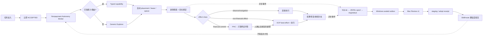

# Review × Explorer：仅资金提交硬闸、非支付自由探索严谨化实施计划

> **状态**：`SOURCE_IMPLEMENTATION_PAUSED_HANDOFF`（Phase 1 与 Phase 2 核心已实施；未部署；payment control surface 延后 Phase 8 交接）
> **计划编号**：`REX-FREEDOM-V1`
> **版本**：`0.3.1`
> **日期**：2026-08-01
> **0.3.1 实施调整**：Phase 1 与 Phase 2 tripwire 核心已落源码；`payment pending/list/decide API + Registry 人类确认页` 经用户要求延后到 Phase 8，详见 `docs/plans/2026-08-01-rex-phase8-payment-control-handoff.md`。
> **部署事实**：未部署、未提交任务、未取得 lease、未碰手机。
> **实施授权**：只有用户明确回复“批准实施本计划/某一阶段”后，对应阶段才可开始。
> **首要目标**：保证所有手机 App 内的非资金提交任务都能被接收、派发、探索和继续；落盘、Review、Skill 成熟度、路由、证据与资源协调只能帮助运行，不能重新成为派发锁。

---

## 0. 先写死：本计划如何防止漏改、夹带和偷偷扩范围

### 0.1 三次独立授权

本计划把后续工作拆成三次授权，互不自动包含：

1. **源码实施授权**：允许修改本文白名单内的两个源仓；不包含 Windows 部署，不包含碰手机。
2. **Windows 暗部署授权**：允许把已评审 commit 部署到项目相关 Windows 路径，保持 shadow/空 pilot；不包含手机动作。
3. **真机 pilot/扩容授权**：允许按本文指定 alias、actor、动作矩阵运行；支付最终提交始终不包含在授权内。

只批准前一项，不代表自动批准后一项。

### 0.2 文件白名单是硬边界

- 实施前从本文 §8 生成机器可读的 `docs/plans/2026-08-01-review-explorer-payment-only-gate-plan.files.json`。
- 每阶段开始记录两仓 `HEAD` 和 `git status --short`；每阶段结束输出 `git diff --name-only` 与白名单逐项对账。
- **计划外修改文件数必须为 0**。
- 如果语义扫描或测试发现必须修改未列出的文件：停止该阶段，只提交“计划增补”，说明文件、函数、原因、行为变化和测试；用户过目后才能继续。
- 不允许以“顺手修一下”“测试需要”“格式化产生”“生成文件”为由夹带。
- 不允许全仓格式化、无关重构、依赖升级、坐标/recipe 顺手调整、数据库清理、历史证据重写。

### 0.3 每个提交只做一种事

REX 开始前，先由独立的 governance 轻计划完成“评判 Skill + 第一刀 staging 收编”；该提交不属于 REX，也不能与 REX 并行改同一文件。REX 自身预计最少拆成以下可独立审阅的提交；不 squash 成一坨：

1. `contract-and-red-tests`
2. `financial-commit-tripwire`
3. `evidence-sidecar-v1`
4. `nonpayment-autonomy-shadow`
5. `explorer-hotpath-parity`
6. `nonpayment-autonomy-active`
7. `mac-review-and-adopt-v1`
8. `device-core-migration`
9. `xhs-migration`
10. `xianyu-migration`
11. `douyin-migration`
12. `wechat-migration`
13. `skills-docs-and-final-consistency`

每个提交必须附：实际文件表、计划对应编号、测试结果、未完成项、证据债务、是否部署/碰机。

### 0.4 源码与部署边界

| 对象 | 本计划起草时锚点 | 角色 | 规则 |
|---|---|---|---|
| Mac 治理仓 | `/Users/a1234/Desktop/Coding/xhs-registry` @ `acc1f3d9ef5868e2b57f944b0d127351a1eeed49` | Review、Skill 真源、跨机证据审查与收编 | 源码实施仓 A |
| 路由/执行源仓 | `/Volumes/GPFS/Users/a1234/Desktop/Coding/xhs-device-agent-routing-v1-1` @ `5d5ed277fc904f20ef69f394f578150e8a36e7f3`，`main` | Windows 控制面、Explorer、adapter、effect/lease/evidence | 源码实施仓 B |
| 禁止误用 checkout | `/Volumes/GPFS/Users/a1234/Desktop/Coding/xhs-device-agent` @ detached `f230122…` | 历史/考古 | **禁止实施修改** |
| Windows 路由部署副本 | `C:\Users\Public\xhs-routing-v1-1` | 生产执行 | 只接收已评审的 B 仓 `main`；禁止热改 |
| Windows registry 部署副本 | `C:\Users\Public\xhs-registry` | `skills/ops` 执行副本 | 只由 A 仓同步；本地手改会被覆盖 |
| Windows 运行证据 | `C:\Users\Public\xhs-agent-runs` | run/effect/raw/outbox | 不进 Git，不被源码同步覆盖 |

以上 commit 只是起草时快照。实施前必须重新验证；漂移本身不授权改计划外文件。

### 0.5 与 governance 轻计划的串行接棒

两套计划不得同周并行修改共享文件。固定顺序是：

1. governance 轻计划先落地并完成独立验收；职责仅为“评判 Skill、读取现有证据、第一刀 staging 收编”，不改 Windows 运行时授权。
2. governance 合并后冻结新的 A 仓 40 SHA；REX 重新生成 scope manifest、重跑语义扫描和 baseline。
3. 如果 governance 已经满足 Review/staging 的某项要求，REX 不重复改；如果接口不同，先补本计划再动手。
4. REX 的 runtime policy、payment tripwire 和 evidence v1 在后续独立提交中推进。
5. REX 最后才回到治理文件补充 atomic adopt 与新状态语义。

共享文件明确为：

```text
modes/explorer.md
modes/governance.md
.claude/skills/registry-review/SKILL.md
skills/SKILL.md
skills/CONTRIBUTING.md
scripts/review-windows.mjs
scripts/adopt-from-windows.mjs
```

这些文件同一时间只能有一个计划拥有写权限；另一个计划只读。不得靠 rebase 后“顺手解冲突”合并两套语义。

### 0.6 三端不中断原则

| 端 | 迁移期间固定行为 |
|---|---|
| Mac Review/治理端 | governance 先行；REX 重新基线后再改。Mac 离线不影响 Windows 探索。 |
| Windows Explorer/Cursor 端 | Phase 1–5 只改源分支，不同步当前部署；已开始的探索会话固定在启动时的 `releaseId`，不中途换脚本。 |
| 手机/效卫端 | 一个 Explorer 会话只取得一次 lease 并维持心跳；同一会话的连续 tap/input 走持久热通道，不为每一步重复 preflight/拿 lease。 |

暗部署前必须等待 active job/lease 为 0；部署后新会话使用新 release，旧会话先 drain。禁止在正在探索的脚下 pull/restart/覆盖 helper。

### 0.7 过目通过不等于实施授权

本计划 0.3 已通过架构过目，但只表示“可以作为后续实施依据”，不表示现在开始改源码、部署或碰机。

已确认的方向：

- 最终真实资金提交是已同意范围内的唯一硬闸；
- Explorer 使用 session 级 lease + 持久 22222/REPL；
- Phase 4.5/7A 延迟门不过就保留旧 lab；
- governance 轻计划先行，REX 后续重新基线；
- Review/evidence 不进入派发热路径。

仍未确认：

- 内容/消息/草稿/文件删除是否自主；
- 永久注销账号/销户是否自主（当前建议保持未勾）；
- 隐私证据保留期。

下一步默认是先完成 governance 轻计划。开始 REX Phase 1、Windows 暗部署、真机 pilot 仍分别需要 §0.1 的明确授权。

---

## 1. 目标、范围和非目标

### 1.1 目标

1. **非支付零政策死锁**：评论、私信、发布、关注、收藏、账号设置、登录、验证码页面处理、订单创建、财务查询、金额填写、未知 App/未知 op，以及经 §14 单独确认后的删除/永久注销，不再进入人工审批或因治理元数据被拒绝。
2. **唯一硬闸精准下沉**：只有“这一手势成功发出后会直接、最终导致真实资金转移”的动作进入 `financial_commit` 人工等待；保护点落在所有生产输入注入的共同边界，raw tap 也不能绕过。
3. **探索自动兜底**：Skill、capability 或 route 不存在时，系统自动转通用 Explorer；未知不等于禁止。
4. **资源自动协调**：lease 只做互斥与恢复；设备忙时任务已经被接收，自动 queue、换机、续租或恢复，不退回让人重新派。
5. **落盘更严谨但完全旁路**：run/effect/target/before/after/hash/lease/commit 全链可复核；任何证据写入、同步、Review、seal 失败只产生 `evidence_debt`，不影响非支付 adapter 是否执行。
6. **Mac Review 可精确复核**：以机器 manifest、hash、effect ledger 和 release commit 为事实源；Cursor 会话与 Markdown 只作线索/生成视图，不能单独判绿。
7. **收编不半写**：Windows 候选进入 Mac staging，核验 path/base/hash/diff 后原子应用，失败时 Mac 工作树保持原样。

### 1.2 “绝对自由度”的精确定义

这里的“绝对”指 **不存在非支付的政策/治理等待态**，不虚构物理世界一定可完成：

- 无设备、设备断线、缺凭证、App 崩溃、网络断开可以让某分支 `queued/retrying/degraded/waiting_credential`，但不能转成审批或拒绝。
- 系统必须先接受任务，并持续尝试自动恢复、换机或推进其他分支。
- 任务上下文用于导航目标和防止跑题，不是 action/target 白名单，不要求为动态发现的每一步重新发证。
- 预算、时间、步数和视觉次数是观测指标与软检查点；有进展时自动续期，不由人批准。

### 1.3 手机操控范围

在用户交给系统的手机/App 任务范围内，下列均属于可自主执行的非支付动作：

- 社交：关注、收藏、点赞、评论、私信、发送、发布、转发。
- 账号：登录导航、切换账号、设置、资料修改、隐私设置。
- 电商/财务准备：查看余额、账单、订单、交易记录；选择商品、填写金额、选择支付方式、创建未支付订单、进入收银台。
- 私人账号与财务 App 的正常操作和观察。
- 未知 App、未知页面、未知控件的通用探索。

只有 §2 定义的真实资金最终提交需要人。

删除与账号注销从“笼统的非支付”中拆出来单独签字，避免旧 Skill 与新 Explorer 各执行一套：

- **内容/消息/草稿/文件删除**：本计划提议纳入非支付自主 ECP；是否启用见 §14 独立勾选。
- **普通退出登录**：可自主恢复或切号，不等于永久注销账号。
- **永久注销账号/销户**：本计划提议在用户明确接受“只有支付硬闸”后也归入非支付自主；必须单独勾选，不能由总原则默认为已批准。
- 在这两个勾选完成前，对应删除/销户行为保持未批准并沿用当前部署规则；不阻碍计划本身过目通过，但实施者不能代替用户选择，也不能把两项一揽子开启。

### 1.4 明确不做

- 不查看、清理或治理与本项目手机操控无关的 Windows C 盘内容。
- 不自动批准、伪造、复用或绕过支付确认。
- 不把整个钱包、订单、结算页或含“支付”文字的页面划为禁区。
- 不直接写 `control.db`；数据库演进只能由受测的 StateStore migration 完成。
- 不手工清 quarantine、不批量杀进程、不用无 lease 的生产旁路碰机。
- 不删除旧 trace、旧 ACCEPTANCE、旧 ADR、旧知识条目或 SQLite 历史。
- 不把 Windows Cursor 会话当作权威证据；可以参考，但最终判断必须落到项目文件、manifest、commit 或 live receipt。
- 不扩展到桌面自动化、无关文件整理、凭证盘点或其他非手机项目。

---

## 2. 唯一资金硬闸：定义必须足够窄

### 2.1 四级分类

| 分类 | 例子 | 行为 |
|---|---|---|
| `financial_observe` | 钱包、余额、账单、交易记录、订单详情 | 全自动 |
| `financial_prepare` | 选商品、填金额、选支付方式、创建未付款订单、进入收银台 | 全自动 |
| `financial_commit_candidate` | 当前目标控件疑似最终确认，但上下文仍需补观察 | 只暂停这一候选手势；自动刷新 Activity、dump、截图、目标节点；其他动作/分支继续 |
| `financial_commit` | 手势发出后可在没有后续可逆 Agent 操作的情况下直接导致扣款、转账、充值、送礼/红包或免密购买 | 唯一 `waiting_human_commit`；人确认前底层 transport 调用次数必须为 0 |

`unknown` 不自动等于 `financial_commit`。页面出现“支付/钱包/购买”文字也不构成硬闸；判断必须绑定“当前要触发的目标控件”。

### 2.2 正向识别证据

`financial_commit` 至少满足以下一种强证据，或多种独立信号的组合：

1. 已验证 App/支付 SDK 最终提交 selector 或控件指纹；
2. OS/支付 SDK 的最终确认 Activity、Intent 或系统确认界面；
3. 目标控件语义 + 金额 + 收款方/商户 + 资金来源 + 页面阶段等多信号同时命中；
4. 已登记的一键免密/单击扣款控件。

不能仅凭 agent 自报 `declaredIntent`；以新鲜观察到的 target fingerprint 为准。

### 2.3 一次性人类确认绑定

人类确认对象必须绑定：

```text
commitId + runId + effectId + app + accountRef + payeeRef
+ amount + currency + targetControlFingerprint + snapshotHash
+ deviceId + createdAt + expiresAt
```

- 任何字段变化、snapshot 过期、App/账号/设备/控件变化，原确认失效并重新观察。
- Agent 不能自行构造、签发或复用确认 token。
- 人确认只释放这一项资金 effect，不给任务后续资金动作开长期口子。
- 非资金 effect 不得调用 PHC。

### 2.4 必须承认的边界

“所有未知操作都放行”和“对世界上所有未知 App 的一键扣款零漏判”无法仅靠文档同时数学保证。因此本计划选择：

- 不用 `unknown => blocked` 换取表面安全；未知默认继续探索。
- 把资金 tripwire 下沉到生产输入注入边界，并用 App 指纹库 + OS/SDK 信号 + 大量正负 fixture 降低漏判。
- 发现新的免密最终控件后，只补这一控件的正向规则，不扩大成整 App 白名单/黑名单。
- 该边界作为显式风险持续监控，不借风险之名恢复 blanket approval。

---

## 3. 不可破坏的十二条运行不变量

这些不变量必须进入测试、指标和上线检查，不能只写在 Skill 文档里。

1. 唯一可以进入人工等待态的原因码是 `FINANCIAL_COMMIT`。
2. 对任意 `actionClass != financial_commit`：`humanApprovalRequired == false` 且任务提交必须返回 accepted/queued/running/explorer 之一。
3. 非支付任务不得因 R2/R3、external effect、maturity、verified、Skill/version、route、ADR、flag、grant、scope、target、budget、expiry、Review、ACCEPTANCE、SEALED、manifest 或证据容量进入终态 blocked。
4. 缺 Skill、缺 capability、disabled/canary-only、无路由或未知 op 必须自动进入通用 Explorer，不能返回 `unsupported`。
5. lease 是自动资源协调，不是权限；设备忙只能 queue/reroute/resume，不能拒绝或要求人重新提交。
6. 证据 SQLite、JSONL、artifact、seal、Windows→Mac 同步或 Review 失败，只增加 `evidence_debt`；不得改变非支付 transport 调用次数。
7. snapshot stale/missing、target mismatch 或未知页面优先自动重观察、重搜、重绑定或转 Explorer，不升级为审批。
8. 验证码、风控、登录墙、缺凭证只暂停/冷却当前账号或设备分支；其他分支继续。确实需要人提供凭证时状态是 `waiting_credential`，不是授权审批。
9. 某个非幂等 effect 已发送但后态不明时，不裸重放该 effect；进入 `ambiguous/reconciling`，任务其他分支继续。
10. 同设备 effect 串行，跨设备可并行；串行是物理互斥，不是任务未被派发。
11. 所有生产 tap/input/shell 入口经过同一资金提交保护边界；不能靠高级 capability 合规而 raw tap 绕过。
12. Review/收编只能提高或降低“可复核性与路由置信度”，永远不能反向改变 Windows 当前任务的运行权限。

上线后长期指标必须满足：

```text
dispatch_rejected_total{class="nonpayment"} == 0
policy_wait_total{reason!="financial_commit"} == 0
new_nonpayment_waiting_approval_rows == 0
ordinary_primitive_sync_observation_total == 0
```

---

## 4. 当前系统为什么仍可能锁死

现有代码已经有 Mission、ECP、effect ledger、PHC、EvidenceStore 和 Discovery 等好资产，但当前组合仍不是本计划目标，不能直接打开旧 flag 交差。

| 当前锁点 | 现位置 | 当前行为 | 目标行为 |
|---|---|---|---|
| R2/R3/external effect blanket approval | A `registry.mjs:derivePolicy`；B `control-plane/lib/policy.mjs` | 评论/私信/发布等进入等待审批 | 只看 `financial_commit` |
| Mission 自动化 flag/ADR | B `#missionAutoApprovalGate` | flag 或 ADR 未开即 blocked | 不参与非支付派发 |
| Standing Grant/签名 issuer | B `#standingGrantGate`、grant policy/runtime | scope/hash/expiry/issuer 任一不满足即 blocked | grant 仅为可选 provenance，不是许可证 |
| action/target/count/frequency/expiry/parallelism=1 | B mission/delegation schema 与 policy | 动态探索容易超出预先范围 | 变为任务上下文、软预算、调度建议 |
| Discovery 只允许 R0/R1 | B `discovery-session.mjs`、ADR 0010 | 发现真实 effect 即停 | 非支付 effect 走 ECP，支付 commit 走 PHC |
| unknown/stale/mismatch/login/captcha fail closed | B `effect-firewall.mjs` | 当前分支甚至全任务 blocked | 自动重观察/转 Explorer/分支降级 |
| evidence 低磁盘硬门 | B `evidence-store.mjs:assertCapacity` | 外部 effect 提交前失败 | spool/debt，非支付继续 |
| 旧 job 状态 | B `submitJob`、StateStore | legacy R2 进入 `waiting_approval` | 不再生成非支付 waiting row |
| 视觉禁词过宽 | B `scripts/vision-safety.mjs` | 发布、发送、删除、下单、关注等全部禁止 | 只保护资金最终控件；删除按 §14 决定，其他为观察/记录 |
| Explorer preflight 不取得 lease | A `ops/explore-preflight.mjs` | 查 free 后仍可能裸连/竞态 | 自动 session/queue，lease 可见 |
| 证据字段不足 | A `_win-xiaowei/_biz-trace` | 无 run/effect/target/before/after/lease 精确关联 | v1 run/effect envelope |
| Review 模糊联结 | A `review-windows.mjs` | 顶层 Markdown、字符串包含、`version === "1.0"` | exact id/hash/semver/commit join |
| Adopt 直接覆盖 | A `adopt-from-windows.mjs` | 无 staging/base/hash/批次原子性 | staging → verify → atomic apply → receipt |
| Windows ops 是只读部署副本 | A/B 现有同步约定 | Explorer 想改 Skill 容易漂移或被覆盖 | Windows 只产候选 outbox；Mac 决定收编 |

保留并加强的现有资产：SQLite/WAL StateStore、effect ledger、ECP 的 before/after 与幂等语义、PHC 的 durable pending 记录、EvidenceStore 的 run/manifest/artifact hash。不会另造第二套互相冲突的运行数据库。

---

## 5. 目标架构



### 5.1 两条链完全解耦

**执行链**：接收 → 已知能力/Explorer → 自动资源协调 → 观察 → effect/支付分类 → 运行/恢复。

**证据链**：事件 → 落盘降级 → sealed outbox → Mac Review → 候选收编。

Windows 不等待 Mac 返回；Review 宕机、outbox 未 seal、Mac 离线、Skill 未 verified 时，执行链照常推进。

### 5.2 Broker 的决策输出只能是这些

```text
dispatch_known
dispatch_explorer
queue_resource
retry_technical
defer_branch_technical
reconcile_effect
wait_financial_commit
```

新模式下禁止输出非支付 `approval_required`、`unsupported`、`blocked_by_review`、`blocked_by_scope`。

### 5.3 raw 入口收口但不减少自由

- A 仓 `tap/input/shell/swipe` 等 Explorer 脚本仍保留完整手机操控能力。
- “不再裸连 22222”改成更精确的表述：**禁止无会话归属、无互斥、可绕过 payment tripwire 的裸输入；不禁止把 22222 继续作为会话内的低延迟物理传输。**
- lease、preflight、App/账号上下文在 Explorer session 启动时只做一次；连续 tap/input 通过持久 REPL/stream 通道发送，不得每一步重新 SSH、重新拿 lease 或重跑全量 preflight。
- 普通非支付 primitive 最多经过一次本地 policy/sequence 检查；classifier 对普通 tap/input 的同步 dump/视觉/云调用次数必须为 0。只有命中 `financial_commit_candidate` 的目标手势才同步补 dump/screenshot/Activity 观察。
- L0 dump/observation 保持 downgrade-friendly：控制面不可用时允许退化为 lease-free 只读观察；L1 导航和 effect 使用会话级互斥，但不得退化成人工审批。
- 无 capability id 时自动创建 generic Explorer context，不要求先补 Skill。
- B 仓 `gateway-operator`、`fast-operator`、`xiaowei-http-adapter`、`greenarrow-api`、legacy task runner 必须接同一个 protected input wrapper；无法接入的旧生产入口明确退役为 lab-only，不能暗留旁路。
- 当前 ad-hoc lab 通道在 Broker 证明同等手感前保持原样部署，作为基准和可恢复入口；不能先删再让新链路慢慢追性能。
- 最终的 lab/生产两条入口都必须共享 payment-only 本地 guard，但可以共享同一个持久 22222 transport；“统一安全边界”不等于“每一步都绕远路走重 API”。
- “统一入口”只增加会话归属、自动协调与支付保护，不增加动作白名单。

### 5.4 待写入 ADR 0011 的架构决策与取舍

| 决策 | 选择 | 放弃的方案 | 代价/补偿 |
|---|---|---|---|
| D1 派发活性 | 非支付先接受、证据旁路 | 证据完整才允许 effect | 极端落盘全失时无法跨进程 exactly-once；用 `critical_evidence_debt`、reconciliation 和后台回灌诚实补偿 |
| D2 唯一硬闸 | 目标控件级正向识别 `financial_commit` | `unknown/R3/external => 人工` | 需要持续维护支付正例指纹；用低层统一 guard、OS/SDK 信号和正负 fixture 降漏判 |
| D3 任务授权 | task context 是导航/审计元数据 | Mission/Standing Grant action/target/expiry 作许可证 | 动态探索更开放；用 effectId、task relevance、before/after 防跑题与重复，不用审批 |
| D4 非支付严谨性 | ECP 保留 prepare/outcome/ambiguous，但不审批 | 直接裸发或每步审批 | 多一次本地记录/观察成本；换来可恢复与不重发 |
| D5 运行 authority | 复用现有 SQLite/WAL，导出 sealed snapshot | 再建第二个 effects DB 或让 Mac 读 control.db | exporter/兼容层更复杂；避免双主和直接暴露 live DB |
| D6 Review 位置 | Mac 异步订阅 sealed evidence | Review 作为 Windows 下一任务门禁 | Skill 可能暂时低置信运行；unknown 自动 Explorer，Review 只优化后续路由 |
| D7 回滚 | 回到仍自由的 generic Explorer | 回到 legacy blanket approval | 需要在迁移期保留两条自由执行实现；避免故障时任务重新派不下去 |
| D8 Explorer 热路径 | 会话级 lease + 持久 22222/stream + 本地 guard | 每个 primitive 重走 preflight/lease/重 API | 需要维护 session heartbeat/sequence；用同场景基准、release pin 和 drain 部署换取秒级试错手感 |

ADR 0004/0008/0009/0010 保留历史正文，只加 superseded 指针；不能为了看起来一致而重写过去。

### 5.5 迁移期“运行代码为准 + 文档债明示”

完整 App Skill 迁移在 commit 9–12，不能因此让 Phase 7 的探索会话继续按旧 Markdown 自我设限。迁移期固定权威顺序：

```text
deployed release code + live agent-entry/task packet
  > 当前顶层 AGENTS / modes / skills 路由说明
  > 尚未迁移的 App 子 Skill Markdown
```

在 active 前必须先同步最小执行契约：A 仓 `AGENTS.md`、`modes/explorer.md`、`skills/SKILL.md`；B 仓 `AGENTS.md`、`docs/agent-entry.md`、`skills/xhs-device-operator/SKILL.md`。完整 App Skill 仍按独立提交逐个迁移。

每个 task packet 和 health/release manifest 必须明示：

```json
{
  "releaseId": "...",
  "runtimePolicyVersion": "xhs.nonpayment-autonomy.v1",
  "effectiveDecisionSource": "deployed-runtime",
  "policyDocDebt": [
    {"path": "skills/.../SKILL.md", "legacyRule": "...", "supersededForRelease": "..."}
  ]
}
```

- `policyDocDebt` 只提醒哪些 Markdown 仍旧，不阻止任务。
- 旧 Skill 写“需审批”时，当前 release 的 task packet 必须明确该条已 superseded，避免会话自行停止。
- payment guard 仍以运行代码为硬边界，旧文档不能放宽它。
- 任一 App 完成文档迁移后从 debt 列表移除；最终完成时 debt 必须为 0。
- 如果最小执行契约尚未同步，`nonpayment_v1` 不得 active；这是一项发布一致性门，不是手机任务的运行时审批。

---

## 6. 状态机与失败处理

### 6.1 任务/运行状态

```text
RECEIVED
  -> ACCEPTED
  -> ROUTED_KNOWN | ROUTED_EXPLORER
  -> WAITING_RESOURCE | RUNNING
  -> COMPLETED
     | COMPLETED_WITH_EVIDENCE_DEBT
     | PARTIAL_TECHNICAL
     | RETRYING
```

分支可以独立为：

```text
RUNNING | DEFERRED_TECHNICAL | WAITING_CREDENTIAL | COOLING_DOWN | RECONCILING
```

只有某个资金 effect 可以是 `WAITING_HUMAN_COMMIT`；不能把整个非支付任务推进到该状态。

### 6.2 非支付 effect 状态

```text
CREATED
  -> PREPARE_BEST_EFFORT
  -> DISPATCHED
  -> OBSERVED_SUCCEEDED
     | DEFINITELY_NOT_SENT
     | FAILED
     | AMBIGUOUS
  -> VERIFY_ASYNC | RECONCILING
```

- `DEFINITELY_NOT_SENT`：刷新上下文后可用同一 effectId 有界重试。
- 已经 `DISPATCHED` 但后态未知：不得裸重发；只做观察式 reconciliation。
- 单个 effect ambiguous 不冻结其他目标、设备或动作。
- 如果所有持久化介质同时失败，系统无法同时保证跨进程 exactly-once 与绝不阻塞。本计划明确优先派发活性，报告 `critical_evidence_debt`，不得伪称 exactly-once。

### 6.3 Evidence/Review 状态与执行正交

```text
NOT_LANDED -> PARTIAL -> SEALED -> REVIEWED -> ADOPTED
                         \-> CONFLICTED | EVIDENCE_DEBT
```

Review 可以拒绝收编，但不能撤销或冻结 Windows 的运行权限。

### 6.4 自动处理表

| 情况 | 新行为 | 明确禁止 |
|---|---|---|
| lease 被占 | 立即接受任务，公平排队；尝试兼容设备；aging 防饥饿 | 返回审批/要求重提 |
| lease 状态未知 | 后台刷新本地权威状态；保持 accepted | 以“拿不准”为由拒绝 |
| effect 前丢 lease | 重取 lease、刷新 App/账号/目标后执行 | 裸跑 |
| effect 后丢 lease | 当前 effect ambiguous；其他分支继续 | 自动重复发送 |
| 设备离线/隔离 | 自动恢复或换机；任务保持可恢复 | 政策 blocked |
| 账号不匹配 | 自动识别、切换、登录或选已有同账号设备 | 升级审批 |
| 缺凭证/二次认证 | `waiting_credential`，继续其他分支 | 冒充人或泄露凭证 |
| target mismatch | 回退、重搜、重绑定或跳过单候选 | 整任务停止 |
| UI 漂移/未知页 | dump/semantic/vision 降级，转 generic Explorer | unsupported |
| 验证码/风控 | 当前账号/设备冷却，尝试其他分支 | 绕过平台安全机制或把全任务锁死 |
| 超时间/步数 | 记录 checkpoint，自动续期；无进展时只停该分支 | 人工发新 grant |
| Mac 离线/commit 漂移 | provenance/evidence debt | 阻止 Windows Explorer |

---

## 7. 严谨落盘与跨机 Review 契约

### 7.1 运行时事实源

- B 仓现有 `control.db` + SQLite WAL 继续作为 Windows 运行状态权威；不复制数据库到 Mac，不另造并行 authority。
- 每个 effect 具有稳定 `runId/flowId/branchId/effectId/idempotencyKey/sequence`。
- before/after、target、账号、设备、lease、adapter dispatch、restore、verification 分开记录；不得用“进程 exit 0”代替业务成功。

### 7.2 落盘降级链

```text
A. SQLite / effect ledger
   -> 写失败
B. run 目录 append-only JSONL spool
   -> 写失败
C. 进程内 ring buffer + 结构化 stdout receipt
   -> 进程退出前仍失败
D. critical_evidence_debt
```

规则：

- 非支付动作在 A/B/C/D 任一层都继续执行。
- repair worker 后台回灌，保留原 eventId/effectId 去重。
- 低磁盘时降低截图采样、保留关键帧/hash、轮转旧 raw；禁止在 adapter 前调用硬 `assertCapacity`。
- payment commit 例外：其 pending commit 的最小持久化 receipt 必须成功，否则不执行该资金手势；这不影响任务其他非支付分支。

### 7.3 Windows 目录结构

在现有 `C:\Users\Public\xhs-agent-runs` 下演进，不覆盖旧数据：

```text
runs/<runId>/                     # 现有/扩展的运行证据，可能含 Windows-only raw
spool/<processId>/*.jsonl         # 写入降级与待回灌事件
explorer-outbox/
  index.jsonl
  <runId>.partial/
    task-context.json
    manifest.json
    events.jsonl
    effects.jsonl                 # 从 SQLite 导出的只读快照，不是第二 authority
    evidence/index.json
    candidate/                    # Skill/op/recipe 候选，不直接改 Windows skills
    final.json
    recovery.json
  <runId>/
    ...
    SEALED
scratch/<runId>/                  # 临时探索脚本，带 TTL，绝不当正式 Skill
```

封存流程：写 `.partial` → fsync/close → 计算每项 SHA-256 → 写 manifest → 原子 rename → 最后写 `SEALED`。封存后不可原地修改；补充材料形成 amendment 并引用原 runId。

### 7.4 契约命名与版本

为避免覆盖现有 Mission v1 和 EvidenceStore `schemaVersion=2` 的语义，新契约使用命名版本：

- `xhs.nonpayment-autonomy.v1`
- `xhs.explorer-run.v1`
- `xhs.trace.v1`
- `xhs.review-receipt.v1`
- `xhs.adopt-batch.v1`
- `xhs.payment-approval.v1`
- `xhs.cross-repo-release.v1`

每个 bundle 携带 `schemaId/schemaVersion/contractSha256/producerCommit`。A/B 两仓通过合同 hash parity 测试防漂移；不在运行时通过网络取 schema。

### 7.5 manifest 最小字段

```json
{
  "schemaId": "xhs.explorer-run.v1",
  "runId": "run_...",
  "taskId": "task_...",
  "actor": "...",
  "app": "...",
  "deviceId": "...",
  "accountRef": "redacted:...",
  "leaseId": "lease_...",
  "startedAt": "...",
  "endedAt": "...",
  "producerCommit": "<40-sha>",
  "registryCommit": "<40-sha-or-null>",
  "policyMode": "nonpayment_v1",
  "evidenceMode": "v1",
  "effects": [],
  "artifacts": [],
  "candidateFiles": [],
  "evidenceDebt": [],
  "cleanup": {},
  "privacy": {},
  "contractSha256": "..."
}
```

旧数据缺 run/effect 字段时保持 `null` 并标 `legacy_narrative`；绝不伪造关联。

### 7.6 Mac Review 的精确规则

- 只按 exact `runId/effectId/skillId/capabilityId/artifactSha256/producerCommit` join。
- Skill 版本按 semver，不再写死 `version === "1.0"`。
- 分开判断：process completion、adapter dispatch、effect observed、verification、cleanup、evidence completeness、deployment freshness。
- 一个当前、哈希完整的 E2 成功 run 足以支持收编；重复次数只提高 confidence，不是派发许可。
- 坏 JSONL、半行、CRLF、编码错误、重复记录全部计数并报告；不静默吞，也不影响 Windows 运行。
- `ACCEPTANCE-*.md` 与 Cursor 会话由结构化数据生成/引用，仅为人读视图。

### 7.7 Adoption 原子性

1. 只读取 sealed bundle。
2. 校验 schema/hash/base commit/目标路径 allowlist。
3. 复制到 Mac 临时 staging，不触碰工作树。
4. 生成 `new/same/conflict/rejected` diff 预览。
5. 对批准的 batch 原子应用；任一文件失败则整批不写。
6. 写 `adopt receipt`，绑定 Windows manifest hash、Mac before/after commit 和每个文件 hash。
7. 重跑同一 batch 必须幂等。

自动候选不得修改根治理文件、支付 guard、部署脚本、密钥或历史 ADR。Review/adopt 失败不影响 Windows 探索。

### 7.8 隐私与保留

- 原始私信、联系人、账号、余额、订单、支付/财务截图默认只留 Windows 受控 raw 区，不进 Git，不默认传 Mac。
- Mac 默认只取脱敏字段、哈希、目标类别、结果与必要的裁剪证据。
- manifest 每个 artifact 必须有 `privacyClass/redaction/retentionUntil/exportAllowed`。
- 建议默认：raw 私密证据 7 天、脱敏 sealed bundle 30 天、hash/receipt 180 天；这是待用户批准的默认值，可配置，但删除只能由单独维护任务执行。
- token、密码、auth header、私钥不得进入 trace、stdout、bundle 或测试 fixture。

---

## 8. 两仓逐文件 change-set（实施白名单）

以下是本计划允许修改/新增的完整范围。实施可以只改其子集，但不能超出。若真实依赖要求新增文件，走 §0.2 增补流程。

### 8.1 A 仓：Mac `xhs-registry`

#### A0. 本计划与机器 scope

| 文件 | 动作 | 唯一目的 |
|---|---|---|
| `docs/plans/2026-08-01-review-explorer-payment-only-gate-plan.md` | 已新增；后续只按用户意见修订 | 人类批准正文 |
| `docs/plans/2026-08-01-review-explorer-payment-only-gate-plan.files.json` | 新增 | 机器检查两仓允许文件、阶段和测试映射 |

#### A1. 核心治理、registry 与 UI/API

| 文件 | 计划改动 |
|---|---|
| `registry.mjs` | `derivePolicy/buildTaskPacket` 改为 `dispatch_known/dispatch_explorer/wait_financial_commit`；external/R2/R3 不再等于 approval；operator submit 对所有非支付 capability 开放，未知转 Explorer；approval 面板改为资金提交确认；legacy approval 只读兼容；新增 payment commit list/decide proxy；Review/证据 debt 不影响 submit。 |
| `tests/registry.test.mjs` | 反转旧 R2/waiting assertions；增加非支付零审批、unknown→Explorer、payment-only UI/API、operator token 不可决定支付、legacy compatibility。 |
| `install-registry-task.ps1` | 仅为 payment approval signer/public-key 或 Review inbox 配置提供受控参数；禁止把私钥写命令行/日志；若最终无需新配置则不改。 |
| `docs/observer-api-20260729.md` | operator submit/job 的新非支付语义、session fallback、payment endpoint 与角色隔离；澄清目前只有 `/api/operator/session` 是 501，不误写整组 operator API。 |
| `package.json` | 把新 schema/review/adopt/scope/tests 纳入 check；不升级依赖。 |
| `.gitignore` | 忽略 inbox/staging/cache/raw/outbox 测试外运行物；保留 fixture。 |
| `PROGRESS.md` | 只在实际完成部署/验证后更新真实状态；不能预写完成。 |

#### A2. Review、证据、收编脚本

| 文件 | 计划改动 |
|---|---|
| `scripts/review-windows.mjs` | manifest/index reader、semver、exact joins、hash/commit freshness、独立结论、legacy fallback、debt 报告。 |
| `scripts/adopt-from-windows.mjs` | sealed-only、staging、path/base/hash checks、diff、atomic batch、rollback、receipt、幂等。 |
| `scripts/validate-run-bundle.mjs` | 新增；离线验证 bundle，绝不调用 Windows/设备。 |
| `scripts/render-acceptance.mjs` | 新增；从 manifest/review receipt 生成 Markdown。 |
| `scripts/lib/evidence-contract.mjs` | 新增；A 仓统一 schema/hash/reader helper。 |

#### A3. 新 schema/contract

统一放 `contracts/`，不与旧 EvidenceStore 数字版本冲突：

- `contracts/nonpayment-autonomy.v1.schema.json`
- `contracts/explorer-run.v1.schema.json`
- `contracts/trace.v1.schema.json`
- `contracts/review-receipt.v1.schema.json`
- `contracts/adopt-batch.v1.schema.json`
- `contracts/payment-approval.v1.schema.json`
- `contracts/cross-repo-release.v1.schema.json`

#### A4. Explorer 共用运行层

| 文件 | 计划改动 |
|---|---|
| `ops/_run-context.mjs` | 新增；统一 run/flow/branch/effect/actor/app/device/job/session/lease/sequence。 |
| `ops/_evidence-ledger.mjs` | 新增；prepare/outcome/artifact/spool/debt；写失败不 throw 到业务层。 |
| `ops/_explore-lib.mjs` | 自动 Explorer session/queue、一次性 lease acquire、heartbeat、context 继承、helper 内容 hash、新鲜度缓存；alias 缓存不再作权威。 |
| `ops/_win-xiaowei.mjs` | 保留持久 REPL/22222 低延迟传输；由 session token 绑定 lease/releaseId，primitive 串行；dump 与目标精确绑定；完整 v1 receipt；禁止无会话裸输入。 |
| `ops/_biz-trace.mjs` | 补 run/effect/target/before/after/evidence/lease/sequence/hash；失败返回 debt 而非静默。 |
| `ops/_trace-pitfall.mjs` | 按 app/skill/op/reason/effect 精确聚合；区分 mech/business/debt/conflict；去掉 app 硬编码。 |
| `ops/explore-preflight.mjs` | 从硬门改为诊断 + 自动 acquire/queue/switch/resume；只有输入无效才立即失败。 |
| `ops/SYNC-NOTE.md` | `.SYNCED-FROM` 手工叙述改 sealed outbox + adopt receipt。 |
| `ops/proposal-TEMPLATE.md` | Markdown 引用 manifest/claim/effect/evidence id；观察次数只影响 confidence。 |

#### A5. 原子手机操作脚本

以下文件只接 `_run-context`、自动 session/lease、artifact/effect envelope 与统一 payment guard；不各自新增审批：

- `ops/back.mjs`
- `ops/dump-ui.mjs`
- `ops/focus.mjs`
- `ops/input-text.mjs`
- `ops/launch-app.mjs`
- `ops/screenshot-and-analyze.mjs`
- `ops/shell.mjs`
- `ops/swipe.mjs`
- `ops/tap.mjs`
- `ops/_win-screencap.mjs`

`shell.mjs` 保留非支付操控自由，但敏感命令正文与私密数据不原样落 Mac/Git。

#### A6. 业务脚本

以下脚本增加 run/effect/target/outcome/ambiguous 记录，不增加权限询问：

- `ops/xhs-like-one.mjs`
- `ops/xhs-collect-one.mjs`
- `ops/xhs-follow-one.mjs`
- `ops/xhs-comment-one.mjs`
- `ops/xhs-engage-one.mjs`
- `ops/xhs-dm-open.mjs`
- `ops/xhs-dm-user.mjs`
- `ops/xhs-publish-draft.mjs`
- `ops/xhs-publish-entry.mjs`
- `ops/xhs-search.mjs`
- `ops/douyin-like.mjs`
- `ops/douyin-like-set.mjs`
- `ops/douyin-collect.mjs`
- `ops/douyin-collect-set.mjs`
- `ops/douyin-follow.mjs`
- `ops/douyin-follow-set.mjs`
- `ops/douyin-rail-set.mjs`
- `ops/douyin-search.mjs`

其中 search/entry 等只读导航脚本只生成 claim，不伪造 external effect。实施时同时修正 `xhs-dm-user` 文档中与真实 `--dry-run` 支持不一致的问题。

#### A7. 编排、恢复与 campaign

- `ops/feishu-to-xianyu.mjs`
- `ops/feishu-to-xianyu-lib.mjs`
- `ops/conc2-full-dry-run.mjs`
- `ops/conc4-full-dry-run.mjs`
- `ops/recover-main-safe.mjs`
- `ops/fleet-health.sh`
- `ops/l1-patrol.sh`
- `ops/pnp-sentry.sh`
- `campaign/step.sh`
- `campaign/arm-driver.sh`
- `campaign/ARM-PROTOCOL.md`
- `campaign/acceptance-schema.json`

改动限定为传播 run/effect/recovery receipt、分支局部恢复、兼容新 queue/debt/payment 状态；三个 health/patrol 脚本只更新状态读取与展示，不取得新的执行权限。不得顺便改商品 fixture、SKU/页面坐标或业务 recipe。

#### A8. 治理/Skill 文档

核心文档：

- `AGENTS.md`
- `CLAUDE.md`
- `modes/explorer.md`
- `modes/governance.md`
- `.claude/skills/registry-review/SKILL.md`
- `skills/SKILL.md`
- `skills/CONTRIBUTING.md`
- `skills/shared/preflight.md`
- `skills/shared/transport.md`
- `skills/shared/pitfalls.md`

App/设备 Skill（全部列出，避免只改一半）：

- `skills/device/device-input/SKILL.md`
- `skills/device/device-screenshot/SKILL.md`
- `skills/device/device-shell/SKILL.md`
- `skills/device/device-tap/SKILL.md`
- `skills/xhs/xhs-search/SKILL.md`
- `skills/xhs/xhs-like/SKILL.md`
- `skills/xhs/xhs-collect/SKILL.md`
- `skills/xhs/xhs-follow/SKILL.md`
- `skills/xhs/xhs-comment/SKILL.md`
- `skills/xhs/xhs-dm/SKILL.md`
- `skills/xhs/xhs-engage/SKILL.md`
- `skills/xhs/xhs-publish/SKILL.md`
- `skills/xianyu/xianyu-snapshot/SKILL.md`
- `skills/xianyu/xianyu-publish/SKILL.md`
- `skills/douyin/SKILL.md`
- `skills/douyin/douyin-search/SKILL.md`
- `skills/douyin/douyin-like/SKILL.md`
- `skills/douyin/douyin-like-set/SKILL.md`
- `skills/douyin/douyin-collect/SKILL.md`
- `skills/douyin/douyin-collect-set/SKILL.md`
- `skills/douyin/douyin-follow/SKILL.md`
- `skills/douyin/douyin-follow-set/SKILL.md`
- `skills/douyin/douyin-rail-set/SKILL.md`
- `skills/wechat/SKILL.md`

统一原则：Skill 是优选 recipe/证据契约，不是执行许可证；支付最终提交以底层 tripwire 为准，不靠每份 Markdown 自觉。

#### A9. 新增/更新测试

新增：

- `tests/review-windows.test.mjs`
- `tests/adopt-from-windows.test.mjs`
- `tests/run-context.test.mjs`
- `tests/biz-trace.test.mjs`
- `tests/trace-pitfall.test.mjs`
- `tests/explore-lib.test.mjs`
- `tests/nonpayment-liveness.test.mjs`
- `tests/explorer-hotpath-parity.test.mjs`
- `tests/fixtures/evidence-v1/**`
- `tests/fixtures/explorer-hotpath/**`

允许更新现有：

- `tests/registry.test.mjs`
- `tests/feishu-to-xianyu.test.mjs`
- `tests/xhs-parse.test.mjs`（只有 schema/context 传播触及 parser 时；否则不改）

fixture 只能用合成/脱敏内容，覆盖 CRLF、中文、坏行、半行、重复、legacy Markdown、v1 manifest、hash mismatch、path traversal、base drift。

以下现有文件保留为历史/专用夹具，不修改：`campaign/arm-01.plan`、`campaign/arm-02.plan`、`campaign/arm-04.plan`、`tests/fixtures/trace/2026-07-31.jsonl`、`tests/screen-count-preload.mjs`、`ops/ACCEPTANCE-LOCAL-WIN.md`。其中出现 `dry-run/R2/只读` 等字样不代表它们获得写入权限；若测试证明必须改，先走计划增补。

### 8.2 B 仓：`xhs-device-agent-routing-v1-1`

#### B1. ADR 与总文档

| 文件 | 计划改动 |
|---|---|
| `docs/adr/0011-payment-only-hard-gate-and-evidence-sidecar.md` | 新增；正式记录本计划核心决策，并声明 supersede 旧硬门。 |
| `docs/adr/0004-maturity-risk-and-approval.md` | 只加 superseded 指针，不改历史正文。 |
| `docs/adr/0008-mission-driven-exploration-authorization.md` | 同上。 |
| `docs/adr/0009-standing-grant-delegation.md` | 同上。 |
| `docs/adr/0010-standing-grant-discovery-session.md` | 同上；当前 Proposed 不作为新入口。 |
| `AGENTS.md` | 入口变为自动 job/Explorer/lease；唯一资金 commit 人工；留痕旁路。 |
| `skills/xhs-device-operator/SKILL.md` | 同步真实可执行语义与 payment-only guard。 |
| `docs/SAFETY.md` | 从广义外部效果禁止改为资金最终提交保护 + effect rigor。 |
| `docs/ARCHITECTURE.md` | 双链、Broker、状态机、outbox。 |
| `docs/control-plane.md` | API、状态码、mode、payment endpoints、debt。 |
| `docs/agent-entry.md` | 新入口/命令，不再引导非支付 waiting approval。 |
| `docs/xianyu-publish-dryrun.md` | 去除“发布类天然审批”假设；保留真实 outcome/恢复说明。 |

#### B2. 新契约与纯策略模块

新增：

- `control-plane/schema/nonpayment-autonomy.schema.json`
- `control-plane/schema/explorer-run.schema.json`
- `control-plane/schema/trace.schema.json`
- `control-plane/schema/payment-approval.schema.json`
- `control-plane/schema/cross-repo-release.schema.json`
- `control-plane/lib/nonpayment-autonomy-policy.mjs`
- `control-plane/lib/financial-commit-classifier.mjs`
- `control-plane/lib/payment-approval-verifier.mjs`
- `control-plane/lib/explorer-session-bridge.mjs`
- `control-plane/lib/evidence-exporter.mjs`
- `control-plane/lib/evidence-spool.mjs`

这些 B 仓 schema 必须与 A 仓 canonical contract hash 一致；不得各自漂移。

`explorer-session-bridge.mjs` 只负责“一次 acquire、持续 heartbeat、releaseId/session token、primitive sequence 和持久 transport”；它不得把每个 tap 重新包装成完整 job，也不得同步等待 evidence/Review。

#### B3. 授权、Mission/Grant 与 effect

| 文件 | 计划改动 |
|---|---|
| `control-plane/lib/policy.mjs` | 不再由 risk/external/idempotency 推 blanket approval；统一调用 nonpayment policy。 |
| `control-plane/lib/capability-registry.mjs` | capability 增 `effectClass`；缺 capability 可返回 Explorer fallback，而非 unsupported。 |
| `control-plane/schema/capability.schema.json` | 版本化新增 effectClass/fingerprint；保留 legacy reader。 |
| `control-plane/lib/mission-policy.mjs` | action/target/count/frequency/expiry 从权限门降为上下文/软预算；payment 永远 PHC。 |
| `control-plane/schema/mission.schema.json` | 不原地篡改 v1；新增 v2/开放字段或兼容分支。 |
| `control-plane/lib/mission-runtime.mjs` | grant/hash/scope/budget/expiry 冲突自动 recompile/resume/debt，不拒绝非支付。 |
| `control-plane/lib/delegation-grant-policy.mjs` | grant 退出热路径，成为可选 provenance/revocation metadata。 |
| `control-plane/lib/delegation-grant-runtime.mjs` | parent grant 缺失/过期不阻断非支付；记录 provenance debt。 |
| `control-plane/schema/delegation-grant.schema.json` | legacy v1 保留；新增可选 v2 语义。 |
| `control-plane/lib/discovery-session.mjs` | Discovery 允许发现并执行非支付 effect；硬预算改 checkpoint。 |
| `control-plane/lib/effect-firewall.mjs` | surface 拆 financial observe/prepare/candidate/commit；unknown/stale/mismatch 自动重观察；publish/social 及经 §14 确认的 delete 走 ECP。 |
| `control-plane/schema/effect-intent.schema.json` | effectClass、observed target、snapshot refs、payment context、debt。 |
| `control-plane/lib/effect-commit-protocol.mjs` | 非支付证据写失败继续；支付最小 precommit receipt fail closed；ambiguous 不重放。 |
| `control-plane/lib/effect-ledger.mjs` | 保留 idempotency/reservation；支持 branch-local ambiguous/reconcile，不冻结 mission。 |
| `control-plane/lib/protected-human-commit.mjs` | 只接受 `financial_commit`；一次性绑定/过期/重观察/签名验证。 |
| `control-plane/lib/trusted-human-issuer.mjs` | 仅复用签名验证基础设施并加 purpose binding；standing grant 私钥不能变成 agent 可用 payment approval。 |
| `control-plane/lib/errors.mjs` | 增加可恢复 queue/debt/reobserve/branch 状态；不把它们映射 blocked。 |
| `control-plane/lib/canonical.mjs` | 仅扩稳定 canonical/hash 所需字段；无需要则不改。 |
| `control-plane/lib/json-schema-validator.mjs` | 仅在命名 schema/oneOf 兼容确有需要时扩展 validator；不得放宽旧 schema 校验来“让测试过”。 |

#### B4. 状态、调度、控制面与 CLI

| 文件 | 计划改动 |
|---|---|
| `control-plane/lib/state-store.mjs` | 新 task/branch/evidence/payment 状态；waiting_approval 只作 legacy 历史，新增 payment pending；服务内 schema migration；不手写 DB。 |
| `control-plane/lib/evidence-store.mjs` | 删除非支付 `assertCapacity` 热门；接 spool/debt、sealed export、采样降级。 |
| `control-plane/lib/command-runner.mjs` | 把 run/effect/context 与结构化 receipt 安全传给 adapter；进程 exit、业务 outcome、cleanup 分开；保持 secret scrub。 |
| `control-plane/lib/xiaowei-transport.mjs` | 保留持久低延迟设备传输；在进程内接 session sequence + protected input，raw transport 不能绕过 payment tripwire。 |
| `control-plane/lib/placement.mjs` | 无空闲设备 queue/switch/aging；能力不明转 Explorer。 |
| `control-plane/lib/device-run.mjs` | readiness、tuple、lease、snapshot 问题自动恢复/换机/分支降级。 |
| `control-plane/lib/recovery-inspection.mjs` | recovery receipt 绑定 run/effect/snapshot；恢复只影响相应设备/分支，不把 debt 映射成失败。 |
| `control-plane/lib/operator-access.mjs` | 通用 Explorer 自动申请/附着 lease；不把 bypass env 当常规入口。 |
| `control-plane/lib/legacy-guard.mjs` | legacy 生产写入口必须接 Broker/payment guard；保留只读兼容。 |
| `control-plane/lib/control-plane.mjs` | `submitJob/submitMission/executeMissionPrimitive` 全面接新 policy；未知 fallback；payment begin/decide/list；Review 不在热路径。 |
| `control-plane/bootstrap.mjs` | 加少量 migration modes；旧 ADR/standing-grant flags 不再控制 nonpayment_v1；健康信息带 release/schema/modes。 |
| `control-plane/router.mjs` | generic Explorer、resume/reconcile/evidence status、payment commit list/decide 路由。 |
| `control-plane/server.mjs` | 暴露新状态，正确 HTTP 语义；debt 不返回业务失败。 |
| `control-plane/devicectl.mjs` | CLI 支持 accepted/queue/reroute/branch/payment/evidence；poll 不把 queue/branch 当终态失败。 |
| `control-plane/index-legacy-evidence.mjs` | 旧证据只读 normalize，缺字段为 null；不改写旧文件。 |

#### B5. App capability 与 adapter

全部明确列入，避免只有 XHS 改了、其他 App 仍被旧模式锁住：

- `apps/xhs/capabilities.json`
- `apps/xhs/adapter.mjs`
- `apps/xianyu/capabilities.json`
- `apps/xianyu/adapter.mjs`
- `apps/wechat/capabilities.json`
- `apps/wechat/adapter.mjs`
- `apps/xiaowei/capabilities.json`
- `apps/xiaowei/adapter.mjs`
- `apps/vision/capabilities.json`
- `apps/vision/adapter.mjs`

capability 的 approval/lab/canary/maturity 只影响提示、路由偏好和 evidence confidence；不能禁止非支付。adapter 统一传递 run/effect/snapshot/target/before/after/debt。

#### B6. 所有生产输入入口与视觉规则

| 文件 | 计划改动 |
|---|---|
| `scripts/vision-safety.mjs` | 删除发布/发送/下单/购买/关注等 blanket 禁词；删除/永久注销按 §14 决定；改成目标控件级 financial commit 正向识别。 |
| `prompts/xhs-page-classifier.txt` | 分类输出四级 financial 类别；私信/发布/未知不再默认 stop；删除/永久注销服从 §14 的单一全局决定。 |
| `scripts/gateway-operator.mjs` | 使用统一 protected input + run/lease/effect context。 |
| `scripts/xiaowei-http-adapter.mjs` | 不允许绕过 protected input；透传观察与 target fingerprint。 |
| `scripts/fast-operator.mjs` | 所有 effectful tap/input 经同一 guard；serve API 保持非支付开放。 |
| `scripts/greenarrow-api.mjs` | effectful primitive 同上；无法接入则生产退役、只留 lab 标记。 |
| `scripts/task-runner.mjs` | legacy task 进入统一 dispatcher/receipt，不直接发真实 effect。 |
| `scripts/xianyu-operator.mjs` | 真实发布及经 §14 确认的删除作为非支付 ECP effect；补 payment surface 上下文；不得顺便改 SKU/坐标/recipe。 |
| `scripts/build-recovery-analysis.mjs` | 输出与 v1 recovery/manifest 精确关联的分析，不再靠松散叙述。 |
| `scripts/dashboard.mjs` | 展示 accepted/queue/branch/debt/payment wait；debt 不渲染成业务拒绝。 |
| `scripts/xhs-watcher.mjs` | 旧 takeover/home/start 生命周期迁到统一 Broker/lease/evidence；不能继续作为未保护的真实动作旁路。 |
| `scripts/xhs-watcher-launch.ps1` | 只负责一次性受控启动并传 release/run context；execute 模式不得绕过 Broker/payment guard。 |

#### B6a. Scout/Explorer 生产者

| 文件 | 计划改动 |
|---|---|
| `scout/scout.mjs` | 接入统一 Explorer runtime 与 v1 outbox；Skill/recipe 缺失时继续探索，不把固定预算/成熟度当授权。 |
| `scout/scripts/list-recipes.mjs` | recipe 仅作为优选提示，输出版本/hash/confidence，不把不存在映射成 unsupported。 |
| `scout/scripts/post-finding.mjs` | finding 写 sealed candidate/knowledge proposal；写入失败仅 debt，不影响 Explorer。 |
| `docs/explorations/README.md` | 说明结构化 bundle 是事实源、Markdown 是视图。 |
| `docs/explorations/TEMPLATE.md` | 引用 run/effect/evidence/hash，不再用叙述代替执行证据。 |

#### B7. 部署/模式配置

| 文件 | 计划改动 |
|---|---|
| `scripts/control-plane-worker.ps1` | 从 launch config 读取固定 modes/release；不输出 secret。 |
| `scripts/control-plane-task.ps1` | 安装/更新时写 cross-repo release manifest 和 modes；完整 40 SHA。 |
| `config/control-plane.devices.example.json` | 只补 queue/Explorer pilot 示例；不改真实设备配置。 |
| `config/standing-grant-issuer-keys.example.json` | 仅在 payment public-key purpose binding 需要时更新示例；不放真实 key。 |

运行时四个模式提前定死，避免实施中临时造 flag：

```text
AUTONOMY_POLICY_MODE = legacy | shadow | nonpayment_v1
EVIDENCE_MODE        = legacy | dual   | v1
REVIEW_MODE          = legacy | shadow | v1      # 只在 Mac 使用
ADOPT_MODE           = legacy | stage  | atomic  # 只在 Mac 使用
```

pilot selector 从第一版 schema 就存在：

```json
{"mode":"shadow","pilotActors":[],"pilotAliases":[]}
```

长期完成态必须是 `nonpayment_v1/v1/v1/atomic`，并删除“关掉新策略就回到非支付人工审批”的永久后门。迁移期 rollback 也必须回到自由 Explorer，而不是 old blanket approval。

#### B8. 新增测试

- `tests/non-financial-autonomy.test.mjs`
- `tests/payment-tripwire.test.mjs`
- `tests/evidence-debt.test.mjs`
- `tests/autonomous-lease.test.mjs`
- `tests/ambiguous-effect.test.mjs`
- `tests/explorer-hotpath-parity.test.mjs`
- `tests/evidence-exporter.test.mjs`
- `tests/cross-repo-contract-parity.test.mjs`
- `tests/fixtures/nonpayment-autonomy/**`
- `tests/fixtures/payment-tripwire/**`
- `tests/fixtures/evidence-v1/**`
- `tests/fixtures/explorer-hotpath/**`

#### B9. 必须更新的旧测试

这些测试直接覆盖旧锁点，不允许只添新测试而让旧语义继续存在：

- `tests/capability-registry.test.mjs`
- `tests/control-plane-core.test.mjs`
- `tests/control-plane-server.test.mjs`
- `tests/control-plane-mission.test.mjs`
- `tests/control-plane-state.test.mjs`
- `tests/control-plane-placement.test.mjs`
- `tests/control-plane-evidence.test.mjs`
- `tests/control-plane-command-runner.test.mjs`
- `tests/control-plane-transport.test.mjs`
- `tests/control-plane-legacy.test.mjs`
- `tests/control-plane-legacy-index.test.mjs`
- `tests/control-plane-adapters.test.mjs`
- `tests/mission-runtime.test.mjs`
- `tests/mission-explorer-firewall.test.mjs`
- `tests/mission-freedom-acceptance.test.mjs`
- `tests/effect-commit-protocol.test.mjs`
- `tests/effect-ledger.test.mjs`
- `tests/protected-human-commit.test.mjs`
- `tests/delegation-grant-policy.test.mjs`
- `tests/delegation-grant-runtime.test.mjs`
- `tests/discovery-session.test.mjs`
- `tests/discovery-session-state.test.mjs`
- `tests/device-run.test.mjs`
- `tests/recovery-inspection.test.mjs`
- `tests/operator-access.test.mjs`
- `tests/devicectl.test.mjs`
- `tests/standing-grant-supported-path.test.mjs`
- `tests/standing-grant-canary-state.test.mjs`
- `tests/xhs-collect-standing-grant.test.mjs`
- `tests/explicit-observation-receipt.test.mjs`
- `tests/xhs-explore-open-feed-note.test.mjs`
- `tests/vision-safety.test.mjs`
- `tests/gateway-operator.test.mjs`
- `tests/fast-operator-auth.test.mjs`
- `tests/fast-operator-serve-dispatch.test.mjs`
- `tests/fast-operator-serve-lifecycle.test.mjs`
- `tests/xiaowei-http-adapter.test.mjs`
- `tests/scout-exploreFresh.test.mjs`
- `tests/xianyu-page-classifier.test.mjs`
- `tests/xianyu-operator.test.mjs`（只加 effect/payment context，不改业务 recipe 预期）

`protected-human-commit` 测试必须保留并增强，不能为了自由度删掉支付测试。

### 8.3 不在白名单中的已知项

- Windows live `task-launch.json`、真实 device config、service/task 只在“Windows 暗部署授权”后由部署流程生成/更新，不作为源码随手编辑。
- Windows `control.db`、runs 目录、旧 trace、旧 bundle 不作人工修改目标。
- `tests/fixtures/mission-freedom-single-device.fixture.json` 保持为 legacy v1 历史夹具，不原地改义；新语义使用 `tests/fixtures/nonpayment-autonomy/**`。
- 任何未列出的 app operator、recipe、fixture、图片、账号配置、secret 文件都不改。
- 全仓语义扫描允许只读检查其他文件；命中不等于自动获得写权限。

---

## 9. 分阶段实施与每阶段 GO/NO-GO

### Phase 0：用户过目与 scope 冻结（当前阶段）

交付：本计划、逐文件白名单、before/after 矩阵、模式、测试、回滚、未决项。

GO：

- 用户确认唯一硬闸定义；
- 用户分别确认“内容删除”和“永久账号注销”是否纳入非支付自主；
- 用户确认两仓和 Windows 项目路径边界；
- 用户确认文件白名单与隐私保留默认值；
- governance 轻计划与 REX 的串行顺序确定；
- 用户明确授予“源码实施授权”。

NO-GO：

- 仍存在“R2/R3 默认需批”“未知能力禁止运行”“证据不全不可派发”等模糊文字；
- 文件范围仍写成“相关文件”；
- 未确定 payment candidate 和真实 commit 的区别。
- 删除/永久账号注销仍由不同 Skill 各自解释；
- governance 与 REX 同时修改共享文件。

### Phase 0.5：governance 轻计划先落地、REX 重新基线

REX 不写共享文件。等待 governance 完成“评判 Skill + 第一刀 staging 收编”并合并后：

1. 记录 governance commit 和实际文件清单；
2. 重新读取 §0.5 的七个共享文件；
3. 更新本计划 baseline SHA 与 `.files.json`；
4. 对已经实现的 Review/staging 项标记复用，不重复改；
5. 若治理契约与本计划不同，先提交计划增补给用户。

GO：共享文件无并发分支；governance 的运行语义没有进入 Windows 派发热路径；REX baseline 可重放。

NO-GO：靠 rebase 自动吞冲突；两套计划同一周交叉改 adopt/skills/modes；未重新过 scope 就进入 Phase 1。

### Phase 1：scope manifest、契约与红灯测试

只新增 schema、scope checker、合成 fixture 和新不变量测试；不改运行行为、不碰手机。

步骤：

1. 生成 `.files.json`，冻结两仓 baseline SHA/status。
2. 冻结旧 Markdown、mech/biz JSONL 的脱敏 fixture；覆盖 CRLF、中文、坏行、半行、重复。
3. 写 contract parity 测试。
4. 写非支付 liveness、payment positive/negative、evidence failure、lease queue、ambiguous effect 红灯测试。
5. 运行两仓原测试并保存 baseline。

GO：新测试只在已知旧锁点失败；旧测试无无关新增失败；fixture 无真实隐私。

NO-GO：测试需要真机；红灯原因不明确；新增测试靠删旧断言“变绿”。

### Phase 2：资金最终提交 tripwire（先守住唯一红线）

先在纯函数和 fake transport 上完成，不解除旧 blanket gate：

1. 四级 financial classifier 与 target-bound fingerprint。
2. protected input wrapper 覆盖高级 capability 与 raw tap/input/shell 入口。
3. PHC 一次性 binding、过期、重观察、签名/人类角色验证。
4. payment pending/list/decide API 与 registry payment-only UI 的离线测试延后到 Phase 8 的 `8.0 Payment control surface`；Phase 2 只冻结接口、签名和安全边界，详见交接文件。
5. 大量支付负例防误锁；支付正例 spy 断言 transport=0。

GO：所有支付正例 hold，所有 observe/prepare/非支付负例不 hold；raw 和 typed 结果一致。此 GO 只代表 tripwire core，不代表支付决定流程或 Registry UI 已可用。

NO-GO：用页面关键词 blanket 阻止；unknown 一律 payment；任何路径可绕过；agent token 可批准。

### Phase 3：Evidence v1 双写与 Mac Review shadow

不改变授权/adapter 决策：

1. run/effect context 贯穿 A/B 共用层。
2. SQLite → spool → ring/stdout 降级链。
3. sealed outbox exporter、legacy normalizer、Markdown renderer。
4. Review v1 双读 shadow；adopt 只到 staging。
5. 故障注入 ENOSPC/EACCES/目录不存在/SQLite 写失败/坏 JSONL/seal crash。

GO：故障与无故障的 fake 非支付 adapter 调用次数完全相同；新旧四种组合可读；旧证据不改写。

NO-GO：`assertCapacity` 仍能阻止非支付；双写重复 effect；Review 结果影响 submit。

### Phase 4：Nonpayment Broker shadow 与自动 Explorer/lease

同时计算 legacy/new verdict，仍由 legacy 执行；不碰手机：

1. 枚举所有旧硬锁来源及 verdict diff。
2. unknown/no skill/no route → Explorer shadow。
3. lease busy → accepted/queue/reroute shadow。
4. mission/grant/expiry/budget → context/debt/auto-renew shadow。
5. stale/mismatch/risk/login/captcha → reobserve/branch-defer shadow。
6. session bridge 只在 session 开始 acquire 一次；持续 primitive 走持久热通道，shadow 记录额外 hop 和 policy 开销。

GO：全部非支付 fixture 的新 verdict 只有 dispatch/queue/retry/explorer；payment final 全 hold；shadow 不改变 job/lease/adapter 数量。

NO-GO：任何非支付 new verdict 是 approval/unsupported/blocked；payment 漏判；shadow 有副作用。

### Phase 4.5：Explorer 热路径离线与回放性能门

在切换任何生产入口前，先用相同 fixture 和 fake/local transport 对比：

- 当前 `_win-xiaowei` 持久 REPL 基线；
- candidate session bridge；
- L0 dump/focus/screenshot；
- L1 连续 `tap → dump → input → focus → back`；
- 30-step ad-hoc 探索序列；
- 100 次 primitive steady-state；
- payment candidate 额外观察单独统计，不能混入普通 tap 指标。
- 对普通 primitive 注入 dump/vision/cloud spy，调用次数必须为 0；对 payment candidate 则必须命中补观察。

门槛：

```text
session acquire：设备 free 时 p95 <= 2s，且每 session 只发生一次
steady-state primitive：candidate p95 <= direct REPL p95 + max(100ms, 10%)
30-step 总时长：candidate <= direct baseline * 1.10 + 2s
每个普通 primitive：0 次重复 preflight，0 次重复 lease acquire
每个普通 primitive：0 次同步 dump/vision/cloud classifier 调用
L0 控制面不可用：仍可 lease-free read-only dump/observe
```

GO：所有门槛通过，sequence/heartbeat/payment guard 仍正确。

NO-GO：每 tap 走完整 job；重复 SSH/preflight；控制面故障让 L0 失明；为追延迟绕过 payment guard。失败时保留当前 lab，Broker 不进入 active。

### Phase 5：离线 active 与旧断言反转

在 fake adapter 上启用 `nonpayment_v1`：

1. 逐项反转 §8.2 B9 的旧 approval/blocked 断言，并增加对应 liveness 断言。
2. 验证 legacy pending migration：
   - 从未 dispatch 的非支付 waiting job 事务化生成 `queued_migrated`，旧行标 `superseded_by`；
   - 有 dispatch 迹象的旧 effect 只 reconciliation，不重发；
   - payment-like 旧项重新观察后进入 PHC。
3. 两仓全量测试、check、secret scan、scope diff 检查。
4. 生成逐文件 `policyDocDebt`，并验证普通 classifier 的同步 dump/vision/cloud spy 调用数为 0。

GO：测试矩阵全绿；支付测试未删；计划外文件 0；不需要真机。

NO-GO：简单删 blocked assertion；手写 DB；旧任务可能重复发送；回滚只能恢复 blanket approval。

### Phase 6：Windows 暗部署（需要第二次授权）

部署 reviewed commit，但：

```text
AUTONOMY_POLICY_MODE=shadow
EVIDENCE_MODE=dual
pilotActors=[]
pilotAliases=[]
```

不提交手机任务。

部署窗口还必须满足：active jobs=0、active leases=0、没有运行中的 Cursor/Explorer 会话；当前 helper/release 先记录 hash。暗部署只影响新会话，禁止覆盖正在运行的脚本进程。

暗部署阶段同步 §5.5 的最小执行契约，但不批量改 App 子 Skill；health/agent-entry 必须显示 runtime policy、releaseId 和完整 `policyDocDebt`。若 governance 尚未释放共享文件写权限，本阶段不得开始。

部署必须生成：

```json
{
  "schemaId": "xhs.cross-repo-release.v1",
  "releaseId": "...",
  "registryCommit": "<40-sha>",
  "deviceAgentCommit": "<40-sha>",
  "windowsRegistryCommit": "<40-sha>",
  "taskLaunchCommit": "<40-sha>",
  "policyMode": "shadow",
  "evidenceMode": "dual",
  "runtimePolicyVersion": "xhs.nonpayment-autonomy.v1",
  "effectiveDecisionSource": "deployed-runtime",
  "policyDocDebt": [],
  "schemaContracts": [],
  "deployedAt": "..."
}
```

GO：Windows B 仓为 main、HEAD/task-launch/service report 全 40 SHA 一致；health 暴露 release/modes/schema；重启前后零意外 job/lease；legacy/v1 可解析。

NO-GO：手改 Windows 源文件；服务 mode 与 release 不一致；部署触发手机动作；访问无关 C 盘。

### Phase 7：alias 01 单机 pilot（需要第三次授权）

先只开放指定 actor + alias 01；现有自由 Explorer 入口保留，不能先拆。

三端执行会话不需要重读整份 REX。派工只发送一个精简 task packet：`releaseId`、candidate/old-lab 两条命令、alias、7A 场景、指标输出位置、payment 禁止项和 NO-GO 停止条件；架构全文留给治理/验收端。

#### Phase 7A：同机同场景手感对照（先做）

在同一 alias、相近设备状态下，按顺序分别跑当前 lab 与 candidate session bridge 的同一组 ad-hoc 场景，至少包括：

1. 连续 dump/focus/back；
2. 搜索页滚动、点卡片、返回；
3. 输入框 focus/input/清理/返回；
4. 页面漂移后的 dump → 目标重定位 → tap；
5. 30-step 混合探索。

记录 session acquire、每 primitive p50/p95、总墙钟、额外 dump 次数、lease 次数、重连次数和人工等待次数。沿用 Phase 4.5 门槛；任何一项失败都保持当前 lab，不进入 7B。

#### Phase 7B：功能与真实非支付 effect pilot

每个 pilot task packet 必须携带 `runtimePolicyVersion/effectiveDecisionSource/policyDocDebt`；探索会话按当前 release 代码执行，不因 debt 中的旧 Markdown 自我停止。

覆盖：

- 已知 Skill 与无 Skill/无 route 各一条；
- XHS、抖音、微信、闲鱼各至少一条；
- 至少两条真实非支付 effect（具体动作在 pilot 前再次列明，不包含支付）；
- writer failure、lease expiry、snapshot stale、target mismatch、进程崩溃；
- 支付任务只走到 final commit 前，最后一步用 fake/transport spy，不做真钱尝试。

GO：7A 的同场景延迟门全部通过；非支付 approval/waiting=0；unknown 自动 Explorer；落盘故障只有 debt；无重复 effect；lease 自动释放/恢复；payment final transport=0。

NO-GO：candidate 明显慢于当前 lab、每 primitive 重复 preflight/lease；任一非支付需人处理才继续；Review/SEALED 影响下一任务；ambiguous 冻结整任务；支付正例下发。

### Phase 8：01/02 扩容、Review/adopt 切换与文档收口

顺序固定：

1. 先完成 `8.0 Payment control surface`：durable pending、control list/decide、Registry human-only proxy/UI、signer 隔离与全套离线测试；具体交接见 `docs/plans/2026-08-01-rex-phase8-payment-control-handoff.md`；
2. alias 01；
3. alias 01/02 并发；
4. 03/04 只有在各自 ready/资源恢复后加入，不能为赶进度旁路；
5. `REVIEW_MODE shadow → v1`；
6. `ADOPT_MODE stage → atomic`；
7. 同步 AGENTS/CLAUDE/Skill/PROGRESS 的真实完成状态；
8. payment control surface 全部 GO 后，再关闭旧非支付 approval 创建路径。

GO：payment pending/list/decide durable 且仅人类签名可决定、agent/operator/observer 不可决定；同机自动串行、跨机可并行；Mac 离线不影响 Windows；Review 与人工抽查一致；adopt 幂等、冲突零半写；指标满足 §3。

NO-GO：未完成 payment control surface 就关闭旧门；以 Registry 登录代替支付签名；以“严谨”为由恢复白名单；Review 变成下一个任务前置；计划外文档夹带。

### Phase 9：结束双写（不属于首轮实施）

至少经历两个完整版本周期、确认无旧 consumer、完成 rollback 演练后，另提计划停止 legacy 写入。旧 reader 与旧数据本轮不删除。

---

## 10. 完整验收矩阵

| 维度 | 场景 | 必须结果 |
|---|---|---|
| 路由 | 已有 Skill / v0.x / disabled / canary-only / 无 Skill / 无 capability | 全部非支付可派发；后五种可转 Explorer |
| 动作 | observe/input/like/follow/collect/comment/DM/publish/settings/account change | 无人工审批；effect 可复核 |
| 删除 | 内容/消息/草稿删除、永久账号注销 | 以 §14 两项独立勾选为准；一旦勾选即按非支付 ECP 自主执行，不允许各 Skill 自行解释 |
| 财务准备 | 看余额/账单/订单/填金额/选支付方式/进入收银台/创建未付订单 | 自动继续 |
| 支付最终提交 | 付款确认/转账确认/充值/红包/礼物/免密购买/生物确认后的最终触发 | `waiting_human_commit`，transport=0 |
| 支付误报 | 页面含“支付”文字、钱包入口、返回/滚动、非目标购买按钮 | 不得误锁 |
| unknown | 未知 app/op/surface/selector | 默认 Explorer/重观察；不得 approval/unsupported |
| snapshot | stale/missing/target mismatch | 自动刷新/重绑定；不得人工审批 |
| 证据 | ENOSPC/EACCES/目录不存在/JSONL 坏行/SQLite 失败/Mac 离线 | 非支付业务调用不受影响，产生 debt |
| 崩溃 | prepare 前/后、send 前/后、verify/seal/cleanup 中 | 可恢复；已发 effect 不裸重放；其他分支继续 |
| lease | 占用/过期/心跳断/进程重启 | accepted 后 queue/重取/换机，不重提 |
| 并发 | 同机双任务、01+02、同时 append | 同机串行、跨机并行、日志不串 run |
| 分支 | 单账号验证码/风控/缺凭证 | 只暂停该分支；其他分支继续 |
| Review | legacy only/v1 only/双写冲突/hash 不符/stale commit | 给 confidence/debt，不影响 Windows |
| adopt | traversal/base drift/脏树/半批崩溃/重复 apply | 拒绝收编或幂等；Mac 零半写；Windows 不受影响 |
| migration | legacy nonpayment waiting job | 未发送者事务化 requeue；已发送者 reconcile；不重复 effect |
| raw bypass | tap/shell/fast/gateway/xiaowei/greenarrow | 同一 payment tripwire；未知非支付仍开放 |
| 探索手感 | direct REPL 对 candidate session bridge 的同机同场景 p50/p95/总墙钟 | 达到 Phase 4.5/7A 门槛；不重复 preflight/lease；不达标继续旧 lab |
| classifier 热路径 | 普通 tap/input 与 financial candidate | 普通动作同步 dump/vision/cloud=0；只有 candidate 补观察 |
| rollback | mode 回退/旧 reader 读新输出/新表保留 | 不 down-migrate、不丢证据、不恢复 blanket approval |

属性测试必须固定为：

```text
for all actionClass != financial_commit:
  humanApprovalRequired == false
  dispatchAccepted == true

for all actionClass == financial_commit:
  paymentHold == true
  transportDispatchCount == 0
```

---

## 11. 非功能要求（NFR）

### 11.1 活性与性能

- 本地控制面收到合法非支付任务后，应在 2 秒内返回 accepted/queued/explorer；不等待 Review/写 artifact。
- Explorer 是“会话级控制面、primitive 级持久热通道”：lease/preflight 每 session 一次，普通 tap/input 不重复走完整 API。
- free device 的 session acquire p95 ≤ 2 秒；steady-state primitive p95 相对 direct REPL 增量 ≤ `max(100ms, 10%)`；30-step ad-hoc 总墙钟 ≤ direct baseline × 1.10 + 2 秒。
- L0 dump/observe 在 17920 不可用时可降级为 lease-free 只读；该降级不得执行导航/effect。
- evidence writer 不在 adapter 热路径 `await` 网络/Mac；本地 enqueue 失败立即降级。
- queue 使用 FIFO + aging，防止长任务或单设备长期饥饿。
- 同设备最多一个 effectful lease；不同设备按物理能力并发。

### 11.2 可靠性

- effectId/idempotencyKey 在重启、换机、spool 回灌中稳定。
- sealed bundle append-only；adoption batch 原子、可重跑。
- payment pending 必须 durable；控制面重启后默认取消旧 live handle并要求重新观察/确认，不能自动执行。
- 任何指标/健康异常都不能隐式改变 nonpayment policy mode。

### 11.3 可观测性

必须暴露但不作为门禁：

- `explorer_fallback_total`
- `waiting_resource_seconds`
- `evidence_debt_total{layer,reason}`
- `ambiguous_effect_total`
- `financial_commit_candidate_total`
- `financial_commit_false_positive_total`
- `ordinary_primitive_sync_observation_total`
- `policy_verdict_diff_total{legacy,new}`
- `review_lag_seconds`
- `adopt_conflict_total`

### 11.4 安全与隐私

- payment approval 的签发与 agent/operator token 隔离。
- 输入注入边界离线可用，使用 last-known-good classifier；Review/云视觉不可成为 payment guard 的单点依赖。
- 原始私密证据不进 Git；日志 scrub 默认开启；测试 fixture 合成化。
- 不以安全名义扩大成非支付动作白名单。

---

## 12. 回滚方案

回滚目标是“回到仍可自由探索的稳定路径”，不是回到旧的 blanket approval。

1. 先清空 pilot selector，只影响新任务。
2. payment guard 始终保持；不随 autonomy/evidence/review 回滚关闭。
3. 新任务回到现有 generic Explorer 自动路径，不能回到 R2 waiting approval。
4. 已 dispatch 的 effect 只做观察/对账，不强杀、不重放。
5. `REVIEW_MODE`、`EVIDENCE_MODE` 可独立回退，不联动执行 policy。
6. 保留新 SQLite 表、v1 bundle、audit；不 down-migrate、不删除。
7. 代码回滚使用新 revert commit → push reviewed main → Windows pull → task-launch 全 SHA → 重启；禁止 reset/热改。
8. 回滚后核验 health、releaseId、modes、leases、active effects、payment pending、Windows HEAD，并生成 rollback receipt。
9. 新 Broker 未证明至少与当前 Explorer 同样自由前，旧自由 Explorer 通道不得移除。

触发立即回滚/停止扩容的条件：

- 任一非支付进入人工等待或 unsupported；
- payment 正例发生底层 dispatch；
- effect ambiguous 被自动重复发送；
- evidence/Review 故障改变非支付 adapter 调用次数；
- raw 入口绕过 payment guard；
- 计划外文件被修改。

---

## 13. 实施报告模板（每阶段必须交）

```text
阶段：
批准范围：
源仓 A before/after SHA：
源仓 B before/after SHA：
实际修改文件：
计划文件对照：全部命中 / 计划外 N 个
新增行为：
明确未改变行为：
测试：总数、通过、失败、跳过
非支付 liveness：
payment tripwire 正/负例：
证据故障注入：
部署：否 / shadow / pilot aliases
手机动作：无 / 精确列出
effectId/jobId/runId/leaseId：
证据债务：
未完成项：
GO/NO-GO：
```

没有这份对账，不进入下一阶段。

---

## 14. 用户过目签字状态（十一项）

- [x] 同意在已确认范围内“只有最终真实资金提交硬闸；普通非支付动作无人工审批”。
- [ ] 单独同意：内容、消息、草稿和文件删除纳入非支付自主 ECP。
- [ ] 单独同意：永久注销账号/销户也纳入非支付自主 ECP；普通退出登录不算永久注销。
- [x] 同意未知 App/op 默认 Explorer；`unknown` 不自动等于 payment。
- [x] 同意 evidence/Review/Skill/route 只影响置信度，不影响派发。
- [x] 同意 Explorer 使用“session 级 lease + 持久 22222/stream”，而不是每 tap 重走 API。
- [x] 同意 Phase 4.5/7A 延迟门不过就继续旧 lab，不启用 Broker active。
- [x] 同意 governance 轻计划先落地，REX 重新基线后串行实施，不并行改共享文件。
- [x] 同意迁移期以 deployed runtime/task packet 为准，并在 `policyDocDebt` 明示未迁移 Skill；普通 classifier 不同步打 dump/视觉。
- [x] 同意两仓逐文件白名单及三次独立授权机制。
- [ ] 同意隐私证据默认 Windows-only 与建议保留期（raw 7 天、脱敏 30 天、hash/receipt 180 天），或给出调整。

未勾选项不视为拒绝整个计划：对应行为不启用、当前部署规则不变。任何后续选择先修订签字状态；开始 Phase 1 仍需单独的源码实施授权。

---

## 15. 最终完成定义

只有同时满足以下条件，才能宣称“新 Review + Windows Explorer 已完成”：

1. 两仓所有合同、测试和旧断言反转通过，计划外 diff 为 0。
2. 所有生产输入路径共享 payment tripwire；支付正例未确认前 transport=0。
3. 非支付矩阵在无 Skill、无 route、低 maturity、无 Review、无 evidence、lease 忙等组合下仍 accepted/queued/explorer。
4. Windows evidence 能降级、封存并被 Mac exact-hash Review；Mac 离线不影响 Windows。
5. adoption staging/atomic/rollback/幂等通过，无半写。
6. Phase 4.5 与 7A 证明 candidate 达到 direct lab 的延迟/总墙钟门槛，且 lease/preflight 每 session 一次。
7. 普通 tap/input 的同步 dump/vision/cloud 调用数为 0；只有 financial candidate 补观察。
8. 单机与 01/02 pilot 证明非支付 policy wait=0、无重复 effect、lease 自动恢复。
9. Windows `main`、task-launch、service commit、cross-repo release manifest 全 40 SHA 对齐。
10. governance 与 REX 串行接棒完成，共享文件没有两套冲突语义。
11. 文档、Skill、UI/API 与真实运行语义一致，`policyDocDebt=0`，不再暗示普通 R2/R3 需要审批。
12. 回滚演练证明不会重新回到“任务派不下去”。

本计划的核心取舍保持不变：**严谨来自更好的观察、幂等、落盘、复核和恢复；不是来自给非支付任务增加新的许可门。**
