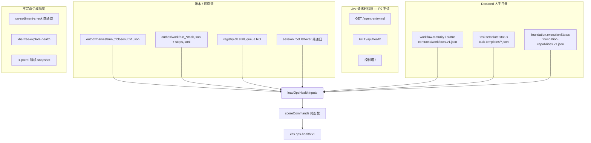
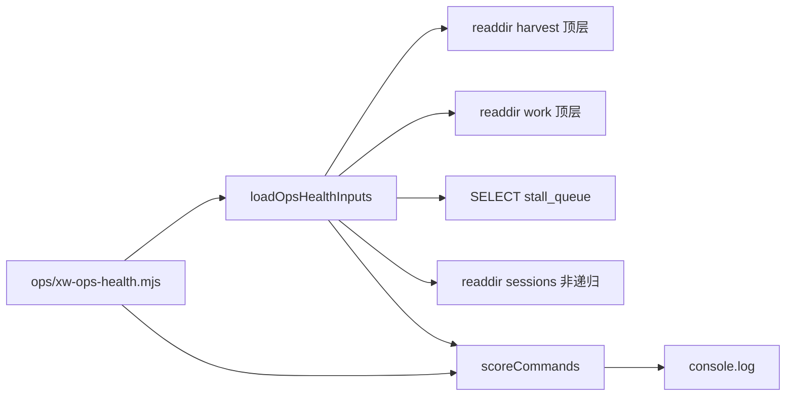
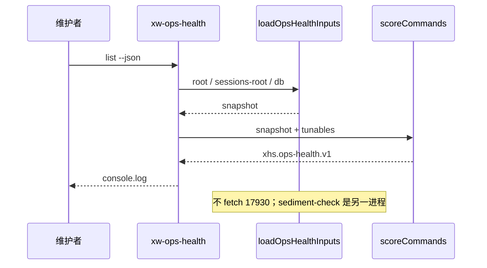

# xw command-health / ops-health：观察成熟度叠加层与维护者日志面

| 字段 | 值 |
|---|---|
| 文档标题 | xw command-health / ops-health |
| 作者 | Grok Design（待人确认） |
| 日期 | 2026-08-13 |
| 修订 | 2026-08-13 **r5**（live explore ≠ stalled；父 goal 先于子线索；POST 移出 P0；success 须全 pass；冻结 nowMs） |
| 状态 | Draft |
| 仓库 | `C:\Users\Public\xhs-registry`（GitHub origin `gifted-professor/xhs-registry`） |
| 权威顺序 | deployed release + live agent-entry > AGENTS/modes/skills > 未迁移 App Skill Markdown |
| 范围约束 | Windows 碰机侧、**仅 Claude Code Skill**；不碰设备、不写 `control.db`、CLI/lib 不写 `registry.db`、不审批、不支付、不部署、不 reload |
| 规范命令名 | **`/xw ops-health`**（canonical）；`/xw health` 仅为别名 |

---

## Overview

`/xw` 现在同时暴露至少七套互不相通的「状态」：目录里人手写的成熟度、请求时的舰队快照、opt-in harvest 账本、单 job 的 UI stall、Explorer session 文件、脚本沉淀检查、watchdog 验收。维护者无法从任一表面回答：「这条命令能不能当默认油门？卡死是这次 UI 卡住，还是这条命令长期不熟？」

本设计在**不改 catalog 枚举、不强迫所有脚本 closeout、不引入新编排器**的前提下，加一层只读的 **observed maturity overlay**：

- **declared** 继续只活在现有 catalog：`draft | canary_only | implemented`（外加既有 `disabled/archived/candidate/retired`，不发明第五种 catalog 状态）。
- **observed** 只从已有文件推导：`unobserved | healthy | flaky | stalled`。
- P0：`node ops/xw-ops-health.mjs list|show` + Skill 一行薄桥接。CLI 本身零设备 I/O、不打 17930；不改 `registry.mjs`。
- 只有 `declared=implemented` **且** `observed=healthy` 才标记为默认 `/xw task` / ops 油门候选；P0 **只报告、不改闸**。
- 日后 patrol 读同一套日志找慢脚本/热点步骤，但仍是 watchdog 兄弟，不是新调度器。

用户面动词用 **`/xw ops-health`**，避免和 `GET /api/health`、`/xw start --check`、`ops/xhs-free-explore-health.mjs` 撞车。`/xw health` 只是别名。

---

## Background & Motivation

### 当前痛点

1. **声明成熟度被误当成运行质量。** `workflow.maturity`（`scripts/lib/workflow-catalog.mjs`）和 `task template.status`（`scripts/lib/task-template.mjs`）都是人手写进 JSON 的。`task.balance.read-all@1` 现在是 `draft`，三条余额 workflow 是 `canary_only`。`task.xianyu.qingdao-idle-listing@1` 是 `implemented`，并不保证最近 N 次 closeout 都 `completed`。
2. **控制塔不是历史。** `registry.mjs` 的 `/`（约 1543 行起）是 live 快照：lease、最近 10 条 job、知识库、审批。`/watchdog` 看 git + `needsEngineer`，不看执行质量。维护者要翻 `outbox/harvest/<runId>/closeout.v1.json` 和 `outbox/work/<runId>/steps.jsonl` 才能知道上次卡在哪一步。
3. **harvest 是 opt-in，且接线比 Skill 表更窄。** 会 `xw-closeout begin` 的只有 `xw-balance.mjs`、`xw-xhs-messages.mjs`、`xw-xianyu-qingdao-listing.mjs`。`xw-mission.mjs` **不** begin，只消费已有 `--run`。`/xw skills`、`start --check`、`task list`、`locator status`、`explore acquire/release`、Skill 行上的 `feishu-to-xianyu-idle-publish.mjs` **都不 harvest**。0 次 harvest 只能叫 `unobserved`（未知），不能叫坏。
4. **现网 `/xw balance` 尚无统一 harvest。** 当前 outbox **没有** goal 含 `三平台账户余额` 的 closeout，也 **没有** `runtime/plans/balance-unified-*.json`。P0 第一次 `list` 里 `/xw balance` 必须是 `unobserved`，这是正确结果，不是实现失败。历史微信四机账本（`run_dcf7b17a-…`，goal=`并发只读查看01至04号机微信服务页展示的余额…`）归 `wechat-balance`，不归 `balance`。
5. **stall ≠ 命令病了。** `scripts/lib/stall-triage.mjs` + `ops/xw-stall-worker.mjs` 处理**这一次 job** 的 `ui_stall / progress_silence / slow_progress / contract_violation`。shadow L2，无 LLM，不碰设备。它不能回答「`/xw balance` 是不是慢性病」。
6. **Explorer 不能按 runner 评分，P0 更不能按 `mode=explorer` 评分。** session 文件在 `%USERPROFILE%\.xhs-explorer-sessions\`，`release` 会 `rmSync` 文件（`ops/_explore-lease.mjs` `releaseExplorerSession`）。该目录是**共享** explorer-primitive 仓库（locator / wechat-balance / xy-idle 都会往里写），且大量过期垃圾 `expiresAt` 仅比 `createdAt` 晚约 60s。`/xw explore` 本身不 closeout。closeout `mode` 是 `explorer|runner|repair|engineering`，`xw-xhs-messages.mjs` 也用 `--mode explorer`。
7. **沉淀检查不是观察成熟度。** `ops/xw-sediment-check.mjs` 四通道只问「脚本存在且留痕了没有」，不问跑得快不快。它会 `fetch` `127.0.0.1:17930/api/knowledge`（失败再 sqlite）。这是**单独的 P0 留痕闸**，不是 ops-health CLI 的 I/O。

### 为什么现在做、而且必须便宜

计划/任务/ops/探索一旦卡住，正确解读是：**这条命令还不够熟，不能当默认生产路径**。但本轮业务还在往前跑。因此只做「读已有账本 + 叠加一层观察结论 + 给维护者看日志」，不强迫每条 `/xw` 改 producer，不改 catalog，不写控制面。

---

## Goals & Non-Goals

### Goals

1. 把现有状态面清点清楚：谁写、谁读、新鲜度、P0 `/xw ops-health` 消不消费。
2. 交付只读 CLI：`node ops/xw-ops-health.mjs list|show`，从 harvest / steps / stall / leftover session 文件推导 observed。
3. Skill 保持薄桥接：一张状态面地图 + 一行 **`/xw ops-health`**（`/xw health` 别名），公式不进 Skill。
4. 维护者能按 command / runId 看到步骤时间线（`ts` 是完成时刻：`duration[i] = ts[i] - (i==0 ? startedAt : ts[i-1])`）。`show --steps` 属于 P0，不是后续加固。
5. 为 P1 SSR 页、P2 patrol 留同一 JSON schema，P0 单独可上。
6. 新脚本过 `docs/ops-sediment-checklist.md` 与 `node ops/xw-sediment-check.mjs`（该检查器自己可能打 17930，见 Non-Goals）。

### Non-Goals（本周期明确不做）

- 不发明第五种 catalog 状态，不把 `unobserved/healthy/flaky/stalled` 写回 `workflows.v1.json` / task-templates / foundation catalog。
- 不强迫每条 `/xw` 命令 closeout。
- 不自动降级 / 提升 declared maturity。
- 不把 patrol 做成新编排器：不 submit job、不碰设备、不改 catalog。
- 不改 `registry.mjs`（P0）。P1 才允许加 `/ops-health` SSR。
- **CLI / lib 不写 `registry.db`**（含禁止 `ensureStallTables`、禁止 POST `/api/knowledge`）。知识库 live 写入不是 P0 验收闸（见 Resolved Decision 3 / PR3b）。不写 `control.db`，不审批，不支付，不部署，不 reload。
- 热路径不上 LLM。
- 金额 / token 不进公共知识库；P0 **永不打开** artifact 正文、`runtime/plans/**`、`*balance*result*.json`。
- 不把 `_run-context.mjs` / `_evidence-ledger.mjs` 强行接到所有脚本。
- 不把 Codex/agents 侧 GPFS Skill 当本轮编辑对象。本轮只改 Windows Claude Code Skill：`.claude/skills/xw/SKILL.md`。
- **不把「整个 P0 切片」说成零 17930。** ops-health CLI / lib 不 fetch 17930/17920；沉淀验收脚本 `xw-sediment-check` 会打知识库 API。两者分开写。

---

## Key Decisions

1. **declared ≠ observed。** declared 继续是人手 catalog；observed 是纯派生字段。两者并列展示，永不互相覆盖。
2. **0 harvest = `unobserved`，不是坏。** 缺账本不能惩罚命令，也不能让它成为默认油门。现网 `/xw balance` 第一次 list 就应是 `unobserved`。
3. **默认油门资格是叠加条件，P0 只报告。** `oilEligible = (declaredNormalized === "implemented") && (observed === "healthy")`。P0 不改 `ops/xw-task.mjs` 的 `template.status !== "implemented"` 闸，也不改 `workflowIsDirectlyRunnable()`。
4. **卡死 = 命令不熟。** 开放 work 目录超时未 close、步骤耗时远超基线、**已 join 到该命令 harvest runId** 的 stall `ui_stall/progress_silence`，都算观察层病征。
5. **两层永远分开。** stall-worker = 这一次 job 的 UI stall；ops-health = 这条脚本慢性病。ops-health **只读** `stall_queue`：禁止 `ensureStallTables`、禁止 INSERT/UPDATE。缺表/锁失败 → `stallSource=unavailable`，不把任何命令打成 stalled。
6. **P0 explore leftover 只诊断，不判 stalled。** `/xw explore` 不 closeout。`mode=explorer` **不是** `/xw explore`。归因用 foreign 前缀黑名单。`sessions.liveExplore` = `active_or_unreleased` 诊断。**`commandId=explore` 的 `observed` 在 P0 恒为 `unobserved`**——P0 不查 live lease，分不出正常占用和泄漏。禁止把未过期 session 文件直接打成 stalled。过期 leftover 同样不是 stalled。
7. **`ts` 是完成时刻。** `durationMs[i] = ts[i] - (i===0 ? startedAt : ts[i-1])`。最后一步仍是 `ts[i]-ts[i-1]`，**不用** `endedAt - last.ts`。单步且缺 `startedAt` → `durationSource=missing`。
8. **事实一处居住。** Skill 只做映射；打分公式、窗口、阈值、`AMOUNT_RE`、`goalPrefixes` 只住在 `scripts/lib/ops-health.mjs` + `--help`。
9. **CLI 零设备 I/O ≠ 整个 P0 零 17930。** lib/CLI 不访问 17920/22222/ADB，不打 live `agent-entry`。沉淀闸是另一个进程。
10. **patrol 是 watchdog 兄弟，不是孩子。** 跑在 **Windows 本机读盘**（与 harvest / session 同一台）。不复用 `watchdog.sh` 的 git/kimi 触发器，也不走 `ops/l1-patrol.sh`（会 submit snapshot）。不经 Mac SSH 拉 JSON。
11. **匹配分两阶段：父 goal 先于子线索。** 先只拿 `task.json.goal` 对 `goalExact`/`goalPrefixes`（表序 first-hit）定父 command。无人命中才用 artifact path / `commandOrRef` fallback。子 workflow（wechat/alipay/weigou）不得接管父 closeout；只能从父 run 里带 `commandOrRefExact` 的 step 单独计分。不认 UUID `taskId`，不认 goal 子串关键字。
12. **规范名 `/xw ops-health`。** `/xw health` 是别名，`--help` 首行必须写清不是 `/api/health` / `xw-start --check` / `xhs-free-explore-health`。
13. **读盘与打分拆开，时钟必须注入。** `loadOpsHealthInputs(root)` 只读 I/O；`scoreCommands(inputs, tunables, { nowMs })` 纯函数，`nowMs` 必填。`generatedAt`、窗口、abandoned、session live **共用同一时钟**。lib 内禁止再写 `Date.now()`。

---

## 状态面清单（必须分清）

| 名称 | 类型 | Owner 文件 | 新鲜度 | 谁写 | 谁读 | P0 `/xw ops-health` 消费？ |
|---|---|---|---|---|---|---|
| workflow.maturity | declared | `scripts/lib/workflow-catalog.mjs` + `contracts/workflows.v1.json` | 文件提交时 | 人改 JSON | `/xw skills`、`/xw task compile-workflow`、agent-entry workflows 段 | **是**（declared 列，本地读 catalog） |
| workflow.status | declared | 同上；枚举含 `implemented/canary_only/candidate/disabled/retired` | 文件提交时 | 人 | 同上；`workflowIsDirectlyRunnable()` 要求 status+maturity 都是 `implemented` 且 `directRun=true` | **是**（declared 辅助；`retired` overlay 映射为 `archived`） |
| task template.status | declared | `scripts/lib/task-template.mjs` + `task-templates/*.json` | 文件提交时 | 人 / 收纳流程 | `/xw task list`（默认只列 implemented）、`run` 硬闸 | **是** |
| capability canary / runnable* | declared+policy | `registry.mjs` `derivePolicy`；现网已把 `runnableAsJob/runnableAsCanarySession` 废弃为 `null`，授权真源在控制面 | 请求时 | registry 读 capability + 控制面 | agent-entry / task-packet | **否**（授权面，不是命令健康） |
| foundation executionStatus | declared | `contracts/foundation-capabilities.v1.json`（locator `executionStatus=canary_only`，`status=implemented`） | 文件提交时 | 人 | agent-entry foundations、`/xw skills`、`/xw locator` | **是**（locator 的 declared） |
| agent-entry.v2 设备态 | live | `registry.mjs` `buildAgentEntry()` / `GET /agent-entry.md` `/api/agent-entry` | 每次请求 | 聚合控制面 + control.db 只读 + 身份缓存 | 所有碰机 agent；`/xw start --check` | **否** |
| `GET /api/health` | live 探活 | `registry.mjs` | 每次请求 | registry 进程 | `xw-start.mjs` 等 | **否**。**不是** `/xw ops-health` |
| `GET /control/v1/health` | live 探活 | 控制面 17920 | 每次请求 | 控制面 | start / explore-preflight | **否** |
| `/api/fleet` | live 脱敏 | `registry.mjs` `buildFleet()` / `redactFleetDevice()` | 每次请求 | 同上 | abtop observer | **否** |
| `/api/devices` | live 聚合 | `registry.mjs` `aggregate()` | 每次请求 | 身份 × 控制面 × lease | 面板、L1 patrol | **否** |
| 控制塔 `/` | live UI | `registry.mjs` ~1543 行 | 每次请求 | SSR | 人 | **否**；P1 另开 `/ops-health` |
| `/watchdog` | 验收 | `registry.mjs` `/watchdog` + `watchdog/watchdog.sh` | 有 git/`needsEngineer` 变化且过 45min 冷却 | kimi supervisor（只验收不派工） | 人 | **否** |
| harvest closeout | 账本 | `ops/xw-closeout.mjs` → `outbox/harvest/<runId>/closeout.v1.json` | 每次 `close` | 已接线脚本 | 收编 / 人翻目录 | **是**（主信号；**无 goal**） |
| work ledger | 账本 | `outbox/work/<runId>/{task.json,steps.jsonl}` | begin/step 时 | `xw-closeout` begin/step | close 时挂到 closeout | **是**（**goal 只在这里**；步骤耗时；未关闭 run） |
| stall_queue | 单 job stall | `scripts/lib/stall-triage.mjs` + `registry.db` `stall_queue` | enqueue/claim/complete | 调用方 enqueue；`xw-stall-worker` claim | stall-worker、测试 | **是**（只读 SELECT；`run_id` 不一定能 join harvest） |
| Explorer session 文件 | 占用凭证 | `ops/_explore-lease.mjs`；目录 `%USERPROFILE%\.xhs-explorer-sessions\`（`defaultExplorerSessionRoot()`，**不**读 `XHS_EXPLORER_SESSION_ROOT`） | acquire 创建，release **删除** | 所有 explorer-primitive 调用方 | Explorer op `--session-file` | **是**（非递归；先剥 token；**foreign 前缀黑名单**；live 的 `02.json` / `${actor}-01.json` 算 explore） |
| Explorer run manifest | 契约（未铺开） | `contracts/explorer-run.v1.schema.json` | 若有人写 | 尚未作为默认 producer | 无统一读者 | **P0 不依赖** |
| `xhs-free-explore-health` | 养号节拍 | `ops/xhs-free-explore-health.mjs` | 跑脚本时 | 该脚本 | 人 | **否**（HEALTH=OK\|PROBLEM，不是命令成熟度） |
| `fleet-health.sh` | 舰队壳 | `ops/fleet-health.sh` | 跑脚本时 | 该脚本 | 人 | **否** |
| sediment | 文档/存在性 | `ops/xw-sediment-check.mjs` + `PROGRESS.md`「ops 沉淀清单」 | 检查时 | 人补知识库/PROGRESS/runtime | 检查器、watchdog 留痕项 | **否**（不参与打分）。P0 **留痕闸**会打 17930 |
| evidence infra | opt-in 库 | `ops/_run-context.mjs`、`ops/_evidence-ledger.mjs` | 调用时 | 主动接线的脚本 | 测试 / 少数链路 | **否** |
| L1 patrol | 设备巡探 | `ops/l1-patrol.sh` | 30min cron | 对 ready 机 submit `xianyu.observe.snapshot` | hermes | **否**；禁止当 ops-health patrol 模板 |

图示：七套表面互不替代。



---

## Proposed Design

### 定位

`ops-health` 是 **maintainer overlay**，不是新产品、不是控制面、不是 Scout。它回答三句：

1. 这条 `/xw` 命令被目录标成什么（declared）？
2. 最近账本看起来怎样（observed）？
3. 最近一次/几次 run 卡在哪一步、耗时多少（logs）？

### 组件与职责

| 组件 | 路径 | 职责 |
|---|---|---|
| 只读装载 | `scripts/lib/ops-health.mjs` → `loadOpsHealthInputs(root, opts)` | 有界 `readdir` 顶层 harvest/work、按名 `readFile`/`existsSync`、只读 SELECT stall、非递归 session。有 I/O，无写。 |
| 纯打分 | 同文件 → `scoreCommands(inputs, tunables, { nowMs })` | COMMAND_INDEX 匹配、耗时推导、runner/explore 状态机、脱敏。**零 I/O**。`nowMs` 必填。测试直接注入 snapshot + 冻结时钟。 |
| CLI | `ops/xw-ops-health.mjs` **新建** | `list\|show`、`--json`、`--help`、`--self-test`。只 `console.log`。调用 load 再 score。 |
| 测试 | `tests/ops-health.test.mjs` + `tests/fixtures/ops-health/` | 见 PR 1 清单（UUID taskId、真实 goal、完成时刻耗时、过期 leftover、金额、非递归扫描）。 |
| Skill 薄行 | `.claude/skills/xw/SKILL.md` | 命令表加 **`ops-health`** 一行 + 状态面地图。不抄公式。 |
| 沉淀 | `RUNTIME_PATTERNS`、`PROGRESS.md`、知识库 seed | 留痕契约。sediment-check 本身可能打 17930。 |
| P1 页 | `registry.mjs` **本周期不改** | 日后 `GET /ops-health` SSR；import `loadOpsHealthInputs` + `scoreCommands`。 |
| P2 patrol | `ops/xw-ops-health-patrol.mjs` **不在 P0** | 读同一 lib，写报告。 |



### 命令身份（COMMAND_INDEX）

harvest **没有** `commandId`。`producer.name` 恒为 `xw-closeout`。closeout **没有** `goal`（schema `additionalProperties: false`）。`taskId` 是 `task_<uuid>`，**不是**模板 id。

P0 匹配器**必须**读 `outbox/work/<runId>/task.json`。禁止用 closeout.taskId / task.json.taskId 去对 `task.balance.read-all` 这类模板 id。可选 `commandId` 字段是合同升级，不在 P0（见 Alternative F）。

#### 匹配算法（两阶段；不许加「goal 含某关键字」）

1. 取 `task.json.goal`（缺 goal 或缺 task.json → 该 run 不能走阶段 1）。
2. **阶段 1（父 goal）**：只拿 `goalExact` / `goalPrefixes`，按表序 first-hit。命中 = **父 command**。`commandOrRef` 与 artifact path **此阶段禁用**。
3. **阶段 2（fallback）**：阶段 1 无人命中，才按表序试 `artifactPathPrefixes`（只比 closeout `artifacts[].path` 字符串，不打开文件），再试 `steps[].commandOrRef` 对 `commandOrRefExact`。
4. **子 workflow**：`wechat-balance` / `alipay-balance` / `weigou-balance` 若父已是 `balance`，**不得**把整条 closeout 算成自己的 harvest 样本。只从该 run 里 `commandOrRef` 命中该子脚本的 **step** 计分。无此类 step → 该子命令 `unobserved`。现网 `xw-balance` 的 `recordTaskStep` 不写 `commandOrRef`，故 weigou P0 就是 `unobserved`。
5. 历史独立 wechat closeout（goal 前缀 `并发只读查看01至04号机微信服务页展示的余额`）走阶段 1，算 `wechat-balance` 自己的父 run。
6. 无人命中 → `_unmapped`。只在 `list --all` 出现。

**禁止**：`goal.includes("balance")`、`goal.includes("编排")`、用 UUID `taskId` 对模板、把 `mode===explorer` 当成 `commandId=explore`、让子 `commandOrRef` 抢走父 closeout。

#### 冻结 `goalPrefixes` / `goalExact`（字面量，含历史别名）

实现必须把这些数组抄进 `COMMAND_INDEX`，测试用同样字符串。改 producer goal 时同步加前缀，旧账本才不会掉进 `_unmapped`。

| commandId | skill | script | skillScript | harvest? | declared | abandonedAfterMs | 冻结匹配线索 |
|---|---|---|---|---|---|---:|---|
| `wechat-balance` | `wechat-balance` | `ops/xw-wechat-balance.mjs` | 同 | 经父 Task 或历史独立 closeout | workflow `canary_only` | 默认 4h | **goalPrefixes**: `并发只读查看01至04号机微信服务页展示的余额` |
| `weigou-balance` | `weigou-balance` | `ops/xw-weigou-balance.mjs` | 同 | 只从父 `balance` 的 child step 计分，不接管 closeout | workflow `canary_only` | 默认 | **无独立 goal**。`commandOrRefExact`: `ops/xw-weigou-balance.mjs` 仅用于从已归属 `balance` 的 run 抽 step，**禁止**阶段 2 用它抢走父 run |
| `messages` | `messages` | `ops/xw-xhs-messages.mjs` | 同 | 是 | unspecified | 默认 | **goalExact**: `小红书消息页未读只读检查（/xw messages）`；**goalPrefixes**: `四机打开小红书消息页并查看有无新消息`（live `run_a26318f8-…`） |
| `xianyu-idle` | `xianyu-idle` | **`ops/xw-xianyu-qingdao-listing.mjs`**（真正 begin closeout / `TASK_RUNNER_BINDINGS`） | **`ops/feishu-to-xianyu-idle-publish.mjs`**（Skill 行；**不** closeout，**不单独打分**） | 仅 listing runner | `task.xianyu.qingdao-idle-listing` = implemented | **12h** | **goalPrefixes**: `青岛飞书商品资料与图片上架闲鱼（发布前停页确认）`、`青岛飞书商品资料与图片上架闲鱼`；**artifactPathPrefixes**: `runtime/plans/qingdao-idle-`（只比 path 字符串） |
| `balance` | `balance` | `ops/xw-balance.mjs` | 同 | 是（现网 **0** 条，故 unobserved） | task `draft` + workflow `canary_only` → **draft** | 默认 | **goalPrefixes**: `三平台账户余额只读（单 Task、单 closeout）`、`三平台账户余额只读`；**artifactPathPrefixes**: `runtime/plans/balance-unified-`（现网无此文件，留给未来） |
| `mission` | `mission` | `ops/xw-mission.mjs` | 同 | **不 begin**；消费已有 `--run` | tooling | — | **`skipScore: true`**。若 `existsSync(outbox/work/<runId>/orchestration)`（对已知相对路径一次 exists，**不** `readdir` run 目录），在 `show mission` 里挂「该 parent 的 orchestration 存在」；observed 仍走 parent 被匹配到的 command，或保持 `_unmapped`。**不要**用「编排」关键字。 |
| `explore` | `explore` | `ops/xw-explore-session.mjs` | 同 | **否** | tooling | — | P0 **无 goal 前缀**（explore 不 closeout）。`scoreKind=explore_leftover`。 |
| `start` | `start` | `ops/xw-start.mjs` | 同 | 否 | tooling | — | `skipScore` |
| `skills` | `skills` | `ops/xw-skills.mjs` | 同 | 否 | tooling | — | `skipScore` |
| `task` | `task` | `ops/xw-task.mjs` | 同 | 否（委派） | 各模板 | — | `skipScore`；`show` 只列出 `TASK_RUNNER_BINDINGS` |
| `locator` | `locator` | `ops/xw-locator.mjs` | 同 | 否 | foundation `canary_only` | — | `skipScore` |
| `closeout` | `closeout` | `ops/xw-closeout.mjs` | 同 | 生产者 | tooling | — | `skipScore` |
| `evolve` / `auto-adopt` / `canary` / `stall` / `sediment-check` / `ops-health` | 同名 | 对应 `ops/xw-*.mjs` | 同 | 否 | tooling | — | `skipScore` |

**明确的 `_unmapped` 样例（夹具必收）：**

- `run_8891b030-a5a8-4558-8fb1-a68271378937`，`task.json.goal` = `收口 /xw skills、task 与 balance 正式入口`，`taskId` = `task_70c7eb03-ee12-4d4b-b8ea-663df375edbc`。goal 里有单词 “balance” **不得**命中 `/xw balance`。
- 任何 `taskId` 长得像 `task_<uuid>` 的 closeout **不得**命中 `task.balance.read-all`。

`declaredNormalized` overlay 取值：

```
draft | canary_only | implemented | disabled | archived | candidate | tooling | unspecified
```

这是 overlay 字段，不写回 catalog。`tooling` / `unspecified` 也不是第五种 catalog 状态。

**`retired` → `archived`。** workflow.status 的 `retired` 先映射再参与保守合并。保守序：

`archived/disabled`（含 mapped retired）> `draft` > `canary_only` > `candidate` > `implemented`。

例：`/xw balance` = task `draft` + workflow `canary_only` → `draft`。若某一源是 `retired`、另一源是 `implemented` → `archived`。

### 读盘规则（P0）

根目录默认 `C:\Users\Public\xhs-registry`，`--root` 覆盖。session 根默认 `join(homedir(), ".xhs-explorer-sessions")`，**ops-health 自有** `--sessions-root`。不要宣称 `_explore-lease.mjs` 已读 `XHS_EXPLORER_SESSION_ROOT`——那个环境变量只被 `feishu-to-xianyu-idle-publish.mjs` / `xianyu-discard-compose.mjs` 使用。

`SCAN_DIR_CAP = 500`。顶层 `run_*` 目录超过则截断并 `sources.*.truncated=true`，不挂死。截断前必须按**目录自身 mtime 降序**排序，保证窗口内最新账本留下。

#### 算法（实现必须逐字遵守）

```text
HARVEST_DIR_RE = /^run_[A-Za-z0-9._-]+$/

listRunDirNames(parent):
  ents = readdirSync(parent, { withFileTypes: true })   # 只这一层
  dirs = ents where isDirectory && HARVEST_DIR_RE
  # lstat 目录本身取 mtime；禁止 readdir 目录内部
  sort dirs by mtime descending
  if mtime equal OR lstat fails: sort those ties by name descending
    (String.prototype.localeCompare(b, "en", { numeric: true }))
  truncated = dirs.length > SCAN_DIR_CAP
  return dirs.slice(0, SCAN_DIR_CAP), truncated

harvestFirst:
  harvestIds = listRunDirNames(root/outbox/harvest)   # cap 500，mtime 新的留下
  for id in harvestIds:
    readFileSync(join(harvest, id, "closeout.v1.json"))  # 只这个文件名
    # 定点 work，禁止两边各 top 500 再 join（会丢关联）
    if existsSync(join(work, id, "task.json")): read task.json
    if existsSync(join(work, id, "steps.jsonl")): read steps.jsonl
    if existsSync(join(work, id, "orchestration")): inputs.orchestrationRunIds.add(id)
    # 禁止 readdir(join(harvest, id)) / readdir(join(work, id))

openWork:
  workIds = listRunDirNames(root/outbox/work)         # 独立有界扫描
  for id in workIds where id not in harvestIds:
    # 未关闭 / 无 harvest 的 work
    if existsSync(task.json): read
    if existsSync(steps.jsonl): read
    if existsSync(orchestration): mark
    # 禁止打开 wechat-balance-result.json / *.png / *.mjs / runtime/plans/**

sessions:
  ents = readdirSync(sessionsRoot, { withFileTypes: true })  # 非递归
  for file in ents where isFile && name.endsWith(".json"):
    parse JSON; if schemaId !== "xhs.explorer-session-context.v1": skip
    delete obj.token IMMEDIATELY
    keep only alias, actorId, sessionId, leaseId, createdAt, expiresAt, mtime, basename
```

测试必须在 `task.json` 旁边放巨大 decoy / `.mjs`，断言从未 `readFile` 它。

**stall：**

```js
const db = new DatabaseSync(dbPath, { readOnly: true });
// 禁止 import / 调用 ensureStallTables
// 禁止 INSERT/UPDATE/CREATE
```

表不存在、文件锁、SQL 错 → `stallSource: "unavailable"`，`stall.rows = []`，**不**因 stall 把任何命令标 stalled。

查询：

```sql
SELECT queue_id, run_id, job_id, state, packet_json, decision_json, enqueued_at
FROM stall_queue
ORDER BY enqueued_at DESC
LIMIT 200;
```

`LIMIT 200` 是**全局**上限，不是每命令。`run_id` 是 enqueue 调用方填的（`body.runId || packet.runId`），**不保证**等于 harvest `runId`。join 不上的行进 `stall.unmatched[]`，不设全局 stalled。

信号读取顺序：先 `packet.stallVerdict.signalType`；仅当 `decision_json` 存在时才看 `decision.diagnosisCode`。`slow_progress` / `slow_but_progressing` 不算 stalled。pending 行 `decision_json` 为 NULL，只靠 packet。

**catalog：** `loadWorkflows()`、`loadTaskTemplates({ includeAll: true })`、`loadFoundationCapabilities()`，全本地。

**禁止：** fetch 17930/17920、ADB、`GatewayOperator`、写任何业务文件、打开 artifact 正文、`runtime/plans/**`、匹配 `*balance*result*.json` 的路径（无论 `redacted` 真假）。`--self-test` 只写系统临时目录。

### 耗时推导

`xw-closeout step` 与所有现网 producer（`recordTaskStep` 等）在**工作完成之后**才 append。`steps[i].ts` 是**完成时刻**，不是开始时刻。

实证 `run_54055f33-35e0-493d-8e3b-592c43b0d1cf`：

| 点 | 时刻 | 正确步耗时 |
|---|---|---|
| `task.startedAt` / closeout `startedAt` | `2026-08-13T02:13:06.897Z` | |
| `fill_and_stop.ts` | `02:21:20.993Z` | **≈494s**（fill） |
| `publish_and_writeback.ts` | `02:24:44.412Z` | **≈203s**（publish） |
| `endedAt` | `02:24:44.424Z` | 比最后一步晚 12ms — **禁止**拿来当最后一步 duration |

错误算法（旧稿：`ts[i]` 当 start、`ts[i+1]`/`endedAt` 当 end）会把 fill 报成 203s、publish 报成 12ms；单步 fill-only（`run_4ab6b282`、`run_1053051a`）会得到 ≈0。

```js
export function deriveStepDurations(steps, startedAt) {
  const out = [];
  for (let i = 0; i < steps.length; i++) {
    const end = parseTs(steps[i].ts);
    const start = i === 0 ? parseTs(startedAt) : parseTs(steps[i - 1].ts);
    const ok = start != null && end != null && end >= start;
    out.push({
      stepId: steps[i].stepId,
      title: steps[i].title,
      kind: steps[i].kind,
      status: steps[i].status,
      ts: steps[i].ts,                 // 完成时刻
      durationMs: ok ? end - start : null,
      durationSource: ok ? "completion_minus_prev" : "missing",
    });
  }
  return out;
}

export function deriveRunDurationMs(closeout, task) {
  const a = parseTs(closeout?.startedAt || task?.startedAt);
  const b = parseTs(closeout?.endedAt);
  if (a != null && b != null && b >= a) return { durationMs: b - a, source: "started_ended" };
  return { durationMs: null, source: "missing" };
}
```

规则：

- 最后一步：`ts[i] - ts[i-1]`，**不是** `endedAt - last.ts`，除非该步自带合法数字 `durationMs` 字段。
- 仅一步且缺 `startedAt`：`durationSource=missing`，禁止标 `adjacent_ts` / `completion_minus_prev`。
- `show` 必须打印 `durationSource`。不得把完成时刻说成 start-timestamp instrumentation。
- 单步 hotspot **不**单独把整命令打成 stalled。

### 窗口与样本

每个 commandId 独立成窗：

1. 收集该命令所有已关闭 harvest，按 `endedAt` 降序。
2. 丢掉早于 `now - WINDOW_DAYS` 的。
3. 再截断为最近 `WINDOW_N` 条。
4. 未关闭 work：`now - startedAt >= (row.abandonedAfterMs || ABANDONED_AFTER_MS)` 记 `abandoned`；更年轻的记 `in_progress`，不计入 failRate 分母。`xianyu-idle` 行覆盖为 **12h**。

### 失败类

| 结果 | 判定 |
|---|---|
| `success` | `closure.status === "completed"` **且** `checks.length >= 1` **且** 全部 `status === "pass"` |
| `partial` | `closure.status === "partial"`，或任一 check `fail` 且不是 `blocked` |
| `blocked` | `closure.status === "blocked"` 或（`blockers.length > 0` 且 status ≠ `completed`） |
| `unverified` | `closure.status === "unverified"`，**或** 任一 check 为 `unverified`/`not_run`，**或** `completed` 但 `checks.length === 0` |
| `abandoned` | 未关闭且超时 |

零 checks 的 legacy **不得**进入 `durationStall` 的 success 基线，也不得把命令打成 `healthy`。

`failLike = partial | blocked | unverified | abandoned`。

### 打分状态机（observed）— runner / 有 harvest 的命令

优先级：**stalled > flaky > healthy > unobserved**。同时满足时 `observed=stalled` 且 `alsoFlaky=true`。

```text
if harvestsInWindow + abandoned == 0:
    observed = unobserved
else if stallHit or durationStall:
    observed = stalled
else if failRate >= FLAKY_FAIL_RATE and samples >= MIN_FLAKY_SAMPLES:
    observed = flaky
else if failLikeCount >= FLAKY_MIN_FAILS_WHEN_THIN and samples < MIN_HEALTHY_SAMPLES:
    observed = flaky
else if samples >= MIN_HEALTHY_SAMPLES and failRate < FLAKY_FAIL_RATE and not stallHit:
    observed = healthy
else:
    observed = unobserved
```

`samples = window harvests + abandoned`（不含 in_progress）。`skipScore` 行的 JSON **形状固定**（禁止省略 `observed`）：

```
observed: "unobserved"
scoreKind: "skip"
oilEligible: false
```

#### stallHit

仅当窗口内某一 **已归属该 command 的 harvest/work runId** 等于 stall 行的 `run_id`，且信号为 `ui_stall` 或 `progress_silence`。未匹配行进 `stall.unmatched[]`。`slow_progress` 单独不算 stalled。`contract_violation` 可进 reasonCodes，不算 stalled。

#### durationStall

仅当窗口内至少 `MIN_DURATION_BASELINE` 条 **success** run 有有效 **run** `durationMs`（`startedAt/endedAt`）：

- `baselineP50` = 这些 success 的中位数
- `windowP95` = 窗口内有效 run duration 的 p95
- `durationStall = windowP95 >= baselineP50 * STALL_P95_MULTIPLIER`

步骤热点写入 `hotspots[]`，不单独 stalled。无足够 baseline → 不因耗时 stalled，reason=`duration_baseline_insufficient`。

### Explorer 另套分（P0 = leftover-only）

`/xw explore` **不**走 runner 状态机，也 **不**把 `closeout.mode === "explorer"` 当证据。

P0 能用的 session 字段只有：`schemaId, sessionId, leaseId, actorId, deviceId, alias, createdAt, expiresAt, contextId, capabilityId`（token 已剥）。**没有** dump/screenshot sha256、步骤、recipe 标记。dump 落在 `os.tmpdir()/xhs-explore/`，与 session JSON 无链接。

#### leftover 分类（漏报-safe 黑名单）

官方 acquire 路径**不止** `xw-explore-*`，且那不是默认：

| 约定 | 出处 | 现网/文档例子 |
|---|---|---|
| `0[1-4].json` | `modes/explorer.md` 双机例 | `02.json` / `03.json` |
| `<run>-<alias>.json` | `AGENTS.md` 复用流程表 | `run_38548d5b-…-01.json`（live 目录已有） |
| `${actor}-${alias}.json` | `_explore-lease.mjs` `defaultExplorerSessionPath`（无 `--session-file`） | `claude-pilot-20260809-01.json` |
| `xw-explore-*.json` | explorer.md 另一种写法 | `xw-explore-ikuuu-install-01.json` |

P0 **禁止**只认 `xw-explore-*` / `explore-*` 白名单（会漏掉上面三条正式路径）。

对每个通过 schema 校验的顶层 json：

1. 先删 `token`。
2. `live = (expiresAt 可解析 && expiresAt > now) || (expiresAt 缺失 && (now - mtime) <= EXPLORE_LIVE_MTIME_MS)`。
3. `stale = !live`。
4. `foreign = basename` 以 `SESSION_FOREIGN_PREFIXES` **任一**为前缀（大小写不敏感）：
   - `wechat-balance-`（live：`wechat-balance-02.json`）
   - `xw-locator-`（live：`xw-locator-intensity-run_a9793dd2-…-01.json`）
   - `xy-idle-`（已知 producer 前缀；2026-08-13 根目录暂无，仍列入）
   - `codex-share-`（live：`codex-share-b-01.json`、`codex-share-batch-01.json`）
5. `exploreAttributed = !foreign`。因此 `02.json`、`claude-pilot-20260809-01.json`、`run_<id>-01.json`、`xw-explore-*.json` 都算 explore。
6. 子目录（`p1-l2-dual/`、`run_*/`）本就不扫描。`hash-scan-result.txt` 不是 json / 无 schema → `skippedNonSchema`。

**P0 不把 live leftover 打成 stalled。** 正常 Explorer 执行期间文件本来就在（`heartbeat` 续命，`release` 才 `rmSync`）。P0 不查 live lease，分不出占用和泄漏。`02.json` / `${actor}-01.json` 仍记入 `sessions.liveExplore`（诊断 `active_or_unreleased`），但 **不**抬 `explore.observed`。wechat/locator/xy-idle/codex-share 走 foreign。

输出（与 `explore.observed` 分开打印）：

- `sessions.liveExplore` / `sessions.staleExplore`
- `sessions.liveForeign` / `sessions.staleForeign`
- `sessions.skippedNonSchema`

#### P0 `commandId=explore` 的 observed

```text
observed = unobserved          # P0 恒如此
if liveExplore.length > 0:
    reasons += ["active_or_unreleased_insufficient_cross_evidence"]
    # sessions.liveExplore 仍输出，供人看；禁止 stalled
if staleExplore.length or staleForeign.length:
    reasons += ["stale_leftover_not_scored", "insufficient_evidence"]
```

过期 leftover **不是** stalled。live leftover **也不是** stalled。acquire→dump、同屏空转：P0 `insufficient_evidence`。以后有 lease/owner 交叉证据再单独切片判 stalled；本周期不 fetch 17920/17930。



### 默认油门叠加

```
oilEligible = declaredNormalized === "implemented" && observed === "healthy"
```

P0 只在 `list` 显示 `oil yes/no`。不改 `runBoundTask`、不改 `workflowIsDirectlyRunnable()`、不改 `/xw skills` 隐藏 canary_only。

### 维护者日志面（P0 `show`，steps 默认开）

`show <commandId|runId>`：

1. 头：declared / observed / oilEligible / reasons[]
2. 窗口计数与 failRate
3. 最近 run 表：runId、endedAt、closure.status、runDuration（`started_ended`）、failLike、stallSignals
4. `--steps` 默认开（`--no-steps` 关）：最近 1 个 run 的完成时刻时间线 + `durationSource` + hotspot
5. `--sessions` 或 `show explore`：leftover 计数（live/stale × explore/foreign），永不打印 token
6. 路径：`outbox/harvest/<runId>/closeout.v1.json`、`outbox/work/<runId>/steps.jsonl`。artifact 只打印 `path` 字符串。
7. **可选 progress 附页（仍只读文件，不是 live agent-entry）**：若 `--runs-root`（默认 `C:\Users\Public\xhs-agent-runs`）下存在 `run_<uuid>/progress.jsonl`，定点打开该文件（禁止 readdir 整个 runs-root），把 `phase/name/step/t/signalType/silenceMs` 收成时间线附在 `show <runId>` 后面。这是 D6231 那种「事后四文件考古」的 CLI 半自动；**不能**替代 job 进行中把 step 透到 `/api/agent-entry`。`fill-results.json` 的 `step` 经常是 null，不要当进度源。

### 相邻切片（不是 ops-health P0）：直播时间线

2026-08-13 01 发 `D6231RPT41`（`job_f0aa923f` / `run_241da77c-…`）实证：墙钟 6 分 39 秒，人手约 1–1.5 分钟。填表 job 自己 315s。能事后用 `progress.jsonl` + 截图 mtime + session-events + job status 四份拼出表，**跑的时候**只能看到 `running/succeeded`，`fill-results.step` 为 null。

税（按杀伤力）：看不见当前 step → 效卫 22222 串行 → fill-all-then-publish-all → 打码 8 轮 dump≈50s（墙钟只要 ~10s）→ 每条 force-stop 37s → 价格不走 supervisor（69s 黑洞）。

`progress.jsonl`（`xhs.stall-progress.v2`）已经在写 `name=open|images|…`、`silenceMs`、`signalType`。控制面不往上透，ops 父进程也不读。

**若要动闲鱼路径，先做最小可看，再砍打码空等：**

1. job 进行中把 `progress.jsonl` 最新一条的 `name/step/elapsed/signalType` 透到 **job status / agent-entry**（改的是 routing 控制面 + `registry.mjs`，**不是** ops-health P0）。
2. 价格收进 supervisor，少一次 sheet 回读。
3. 打码改墙钟 ~10s，不要 8 轮完整 dump。
4. 首页已干净就别杀进程。
5. 四机要再快：拆 22222 锁 + 允许 01 已到发布就点、03 还在填（取消整波屏障）。

ops-health P0 只做第 0 步的 **CLI 读盘版**（`show <runId>` 附 progress.jsonl）。直播上帝视角必须另开 routing/registry 切片。

文本示例（xianyu-idle / `run_54055f33` 语义，实现对齐列而不是逐字符）：

```
/xw ops-health show xianyu-idle
  declared: implemented  (task.xianyu.qingdao-idle-listing@1)
  observed: …            (n=… window=10/14d)
  oil: … 
  last: run_54055f33-…  2026-08-13  closure=…  run=697s (started_ended)

  steps (ts=completion; duration=ts[i]-(i==0?startedAt:ts[i-1])):
   494s  ok     fill_and_stop           durationSource=completion_minus_prev
   203s  ok     publish_and_writeback   durationSource=completion_minus_prev
```

**脱敏（硬规则）：**

- P0 永不打开 artifact 正文、`runtime/plans/**`、路径匹配 `*balance*result*.json` 的文件（无视 `redacted`）。
- **`AMOUNT_KEY_EXACT` 只在走 JSON 对象键时用**，且必须是**整键精确匹配**（大小写不敏感）：`amountCny`、`balanceCny`、`display`。命中则把**该键的整个 value** 换成 `<redacted-amount>`。禁止在自由文本上做 `display` 子串替换（title/notes 里的英文单词 `display` 必须原样留下）。
- 若某个已拷贝字段是字符串且 `JSON.parse` 得到普通对象（例如 notes = `'{"balanceCny":"1810.68"}'`），先对该对象走键，再序列化回去。
- **`AMOUNT_RE`（`¥\s*\d[\d,]*(?:\.\d+)?`）只打自由文本**：goal、title、未能 parse 成对象的 notes、acceptanceConditions、reasons、blockers、claims.narrative。
- `SECRET_KEY_RE` 与 `xw-closeout.mjs` 相同（键名）。再剥字面 `token` 字段。
- 夹具：仿 `run_dcf7b17a` 的 artifact path（`redacted:false`）+ notes 里种 `¥12.34` **以及** `'{"balanceCny":"1810.68"}'`；断言 `¥12.34` 与 `1810.68` 永不出现在 stdout/JSON；断言无关键名上下文的单词 `display` 不被挖掉。

---

## API / Interface Changes

### CLI（P0，唯一新接口）

`--help` **第一行**必须是：

```
xw-ops-health — 命令观察成熟度（不是 GET /api/health，不是 xw-start --check，不是 xhs-free-explore-health / fleet-health）
```

```
node ops/xw-ops-health.mjs list [--json] [--all] [--root <dir>] [--db <registry.db>] [--sessions-root <dir>]
node ops/xw-ops-health.mjs show <commandId|runId> [--json] [--steps|--no-steps] [--root <dir>] [--db <registry.db>] [--sessions-root <dir>]
node ops/xw-ops-health.mjs --help
node ops/xw-ops-health.mjs --self-test
```

| 项 | 约定 |
|---|---|
| 规范用户命令 | `/xw ops-health` |
| 别名 | `/xw health` → 同一脚本；Skill 必须写「别名，勿当成探活」 |
| 无子命令 / `-h` | usage，exit 0（`--help`）或 4（完全空） |
| 未知子命令 | usage + exit 4 |
| 读盘失败（root 不存在） | `XW_OPS_HEALTH_FAILED …` + exit 2 |
| stall 表缺失 | 不失败；`stallSource=unavailable` |
| `--self-test` | 夹具；不依赖现网 harvest |
| 输出 | 仅 `console.log` |
| 默认 `list` | **每一行 COMMAND_INDEX**（含 tooling 与 `explore`）。`skipScore` 行仍输出，形状固定：`observed="unobserved"`、`scoreKind="skip"`、`oilEligible=false`。`explore` 不是 skipScore（`scoreKind=explore_leftover`），默认 list 必须出现，否则 leftover 泄漏面要靠 `--all` 才看得到。 |
| `--all` | **只追加 `_unmapped`**（及 `unmappedRunIds` 明细）。不加「更多 tooling」——它们已经在默认 list 里。 |

### JSON schema（P0 冻结字段，禁止额外必填）

```json
{
  "schemaId": "xhs.ops-health.v1",
  "schemaVersion": 1,
  "generatedAt": "2026-08-13T12:00:00.000Z",
  "root": "C:\\Users\\Public\\xhs-registry",
  "window": { "n": 10, "days": 14 },
  "tunables": {
    "WINDOW_N": 10,
    "WINDOW_DAYS": 14,
    "MIN_HEALTHY_SAMPLES": 3,
    "MIN_FLAKY_SAMPLES": 3,
    "FLAKY_FAIL_RATE": 0.3,
    "FLAKY_MIN_FAILS_WHEN_THIN": 2,
    "STALL_P95_MULTIPLIER": 3.0,
    "MIN_DURATION_BASELINE": 3,
    "ABANDONED_AFTER_MS": 14400000,
    "SCAN_DIR_CAP": 500,
    "STALL_READ_LIMIT": 200,
    "EXPLORE_LIVE_MTIME_MS": 1800000,
    "SESSION_FOREIGN_PREFIXES": ["wechat-balance-", "xw-locator-", "xy-idle-", "codex-share-"],
    "AMOUNT_RE": "¥\\s*\\d[\\d,]*(?:\\.\\d+)?",
    "AMOUNT_KEY_EXACT": ["amountCny", "balanceCny", "display"]
  },
  "sources": {
    "harvest": { "ok": true, "count": 88, "truncated": false },
    "work": { "ok": true, "open": 4, "truncated": false },
    "stall": { "ok": true, "source": "sqlite_readonly", "unmatched": 0 },
    "exploreSessions": {
      "ok": true,
      "liveExplore": 0,
      "staleExplore": 0,
      "liveForeign": 0,
      "staleForeign": 12,
      "skippedNonSchema": 1
    },
    "catalog": { "ok": true }
  },
  "commands": [],
  "unmappedRunIds": []
}
```

`stall.source` 取值：`sqlite_readonly` | `unavailable`。

单条 command（`show` 另带 `runs` / `steps`）：

```json
{
  "commandId": "xianyu-idle",
  "skill": "/xw xianyu-idle",
  "script": "ops/xw-xianyu-qingdao-listing.mjs",
  "skillScript": "ops/feishu-to-xianyu-idle-publish.mjs",
  "declared": {
    "normalized": "implemented",
    "sources": [
      { "kind": "task-template", "id": "task.xianyu.qingdao-idle-listing@1", "status": "implemented" }
    ]
  },
  "observed": "unobserved",
  "alsoFlaky": false,
  "oilEligible": false,
  "scoreKind": "runner",
  "counts": { "samples": 0, "success": 0, "failLike": 0, "inProgress": 0, "abandoned": 0 },
  "failRate": null,
  "duration": { "p50Ms": null, "p95Ms": null, "baselineP50Ms": null, "multiplier": null, "stalled": false },
  "stall": { "hits": 0, "signals": [] },
  "hotspots": [],
  "reasons": [],
  "lastRun": null
}
```

P1 `GET /ops-health`：同样 JSON 包 HTML。P0 无 HTTP 路由。

### Skill 调用

```
/xw ops-health              → node ops/xw-ops-health.mjs list
/xw ops-health show balance → node ops/xw-ops-health.mjs show balance
/xw health                  → 同上（别名）
```

---

## Data Model Changes

**无 schema migration。** 不改 `registry.db` 表，不改 `task-closeout.v1`，不改 workflow/task/foundation 枚举。

只读 `stall_queue` 列（`ensureStallTables` 的形状，但 **P0 禁止调用该函数**）：

```
queue_id, run_id, job_id, verdict_hash, packet_json, decision_json,
state, enqueued_at, updated_at, last_error
```

### 可选后续（明确不在 P0）

- steps 可选数字 `durationMs`（有则优先，缺省仍合法）
- closeout 可选 `commandId` = 合同 bump（`additionalProperties: false`），见 Alternative F
- explore release 无 token 墓碑——**已否决**，不改 session 生命周期；已释放探索保持 `unobserved`

### 存储估计

约 88 个 harvest 目录，**每个只打开一个** `closeout.v1.json`。work 顶层 `readdir` 一次，每 run 最多打开两个固定文件名。禁止走进 144 文件的 `run_9ee98830`。预算：`list` p95 < 3s、内存 < 50MB。超 `SCAN_DIR_CAP` 则 `truncated`。

---

## 打分默认值（可调，实现者不许猜）

全部作为 `export const DEFAULT_TUNABLES`。`--help` 打印同一份。改默认必须改测试。测试**注入 tunables**，不读环境。

| 键 | 默认 | 含义 |
|---|---:|---|
| `WINDOW_N` | **10** | 每命令最多纳入的关闭 harvest 数 |
| `WINDOW_DAYS` | **14** | 只看最近 14 天 |
| `MIN_HEALTHY_SAMPLES` | **3** | 少于此数不能标 healthy |
| `MIN_FLAKY_SAMPLES` | **3** | 用 failRate 判 flaky 的最小样本 |
| `FLAKY_FAIL_RATE` | **0.30** | `(failLike/samples) ≥ 0.30` → flaky |
| `FLAKY_MIN_FAILS_WHEN_THIN` | **2** | 薄样本（n<3）时 failLike ≥ 2 → flaky |
| `STALL_P95_MULTIPLIER` | **3.0** | 窗口 run p95 ≥ 成功基线 p50 × 3 → durationStall |
| `MIN_DURATION_BASELINE` | **3** | 耗时基线所需成功 run 数 |
| `ABANDONED_AFTER_MS` | **14_400_000** | 未关闭 work 默认 **4 小时** → abandoned |
| `SCAN_DIR_CAP` | **500** | harvest/work 顶层 run 目录上限；**先按目录 mtime 降序，再 slice** |
| `STALL_READ_LIMIT` | **200** | stall_queue 全局行数上限 |
| `EXPLORE_LIVE_MTIME_MS` | **1_800_000** | **仅当缺 expiresAt** 时，mtime 在 30min 内才当 live |
| `SESSION_FOREIGN_PREFIXES` | `wechat-balance-`、`xw-locator-`、`xy-idle-`、`codex-share-` | leftover 黑名单；其余 live json 算 explore |
| `AMOUNT_RE` | `¥\s*\d[\d,]*(?:\.\d+)?` | **只打自由文本** |
| `AMOUNT_KEY_EXACT` | `amountCny`、`balanceCny`、`display` | **只匹配 JSON 整键**；禁止当子串挖 `display` |
| `PERCENTILE_METHOD` | `nearest-rank` | `sorted[Math.ceil(p/100*n)-1]` |

P0 **不使用**（保留注释，禁止拿来给 explore 打 healthy/flaky）：

- `EXPLORE_ACQUIRE_TO_DUMP_MS`、`EXPLORE_SAME_SCREEN_LOOP_N` — 无 explore harvest / 无画面哈希。

环境覆盖（可选，不写进 Skill）：

```
XHS_OPS_HEALTH_WINDOW_N
XHS_OPS_HEALTH_WINDOW_DAYS
XHS_OPS_HEALTH_FLAKY_FAIL_RATE
XHS_OPS_HEALTH_STALL_P95_MULTIPLIER
```

解析失败回落默认。

---

## Skill delta

编辑对象：**仅** Windows Claude Code Skill  
`C:\Users\Public\xhs-registry\.claude\skills\xw\SKILL.md`

GPFS `.codex/skills/xw` ≡ `.agents/skills/xw` 本轮不改。

### 1）frontmatter `description`

在 `/xw stall` 后插入：`/xw ops-health /xw health / 命令健康 / 观察成熟度`。

### 2）命令表追加一行（`sediment-check` 之后）

| `/xw 子命令` | 脚本 | 用法要点 |
|---|---|---|
| `ops-health` | `ops/xw-ops-health.mjs` | **只读命令观察成熟度**。`node ops/xw-ops-health.mjs list\|show [<id>] [--json]`。declared（目录）与 observed（账本：`unobserved\|healthy\|flaky\|stalled`）分开。零设备 I/O。阈值见 `--help`，本表不抄。**不是** `GET /api/health`，**不是** `/xw start --check`，**不是** `ops/xhs-free-explore-health.mjs`。别名 `/xw health` 同一脚本。 |

### 3）「执行约定」

状态查询优先只读列表追加 **`/xw ops-health`**（命令观察成熟度，不是舰队 live，不是 registry 探活）。

### 4）新章节（「命令面」与「执行约定」之间）

```markdown
## 状态面地图（不要混用）

权威细节在 `PROGRESS.md` 与 live `agent-entry`；本表只帮你选对入口。

| 你想知道 | 看哪里 | 不要当成 |
|---|---|---|
| 此刻哪台 ready / 谁占 lease | `GET /agent-entry.md` 或 `/xw start --check` | 命令是否成熟 |
| registry / 控制面进程活着吗 | `GET /api/health`、`GET /control/v1/health` | `/xw ops-health` |
| 养号节拍 HEALTH=OK\|PROBLEM | `ops/xhs-free-explore-health.mjs` | 命令成熟度 |
| 舰队壳脚本 | `ops/fleet-health.sh` | 命令成熟度 |
| 目录里这条能不能当正式能力 | `/xw skills`、`/xw task list`（declared） | 最近跑得顺不顺 |
| 最近这条 `/xw` 命令稳不稳 | **`/xw ops-health`**（observed；`/xw health` 只是别名） | 此刻设备是否空闲；也不是探活 |
| 这一次 job 是否 UI 卡死 | `/xw stall` | 脚本慢性病 |
| Explorer 占没释放 | session-file + `leases`；顶层 leftover | runner 成功率 |
| 脚本有没有留痕 | `/xw sediment-check` | 运行质量 |
| git / 需工程师的知识库 | 控制塔 `/watchdog` | 执行耗时 |

默认油门直觉：只有 declared=implemented **且** observed=healthy 才配成为 `/xw task` / ops 默认路径。`/xw ops-health` 只报告，不改目录，不自动降级。
```

**禁止**写入 Skill：窗口 N、0.30、3.0、SQL、`AMOUNT_RE`、goal 前缀表、PROGRESS 摘抄、agent-entry 设备表。

---

## Alternatives Considered

### A. 把 observed 写进 catalog（否决）

污染人手目录；0 harvest 会被标坏；与 `workflowIsDirectlyRunnable()` / listed-must-be-implemented 冲突；patrol 回写等于静默改权限。

### B. 强迫所有 `/xw` 命令 closeout（否决，本周期）

元命令造 harvest 是噪声；explore 不是 runner；拖慢业务接线。未接线保持 `unobserved`。

### C. 在控制塔 `/` 塞命令健康（否决为 P0，P1 另页）

控制塔是 live 快照。P0 不能改 `registry.mjs`。

### D. 复用 L1 patrol 或 evolve-worker（否决）

`ops/l1-patrol.sh` 对 ready 机 `job submit --capability xianyu.observe.snapshot`。evolve-worker 动 overlay。都不是只读观察。

### E. 热路径 LLM 摘要日志（否决）

成本、不可复现、与 stall `calls=0` 相反。

### F. P0 就给 closeout 加可选 `commandId`（否决为本周期；应记录）

新 producer 带 `commandId` 能消掉 goal 前缀表。但 `contracts/task-closeout.v1.schema.json` 是 `additionalProperties: false`，这是**合同 bump**，要改 `xw-closeout.mjs` 校验、所有现网 close 输入、可能的 Mac SHA 锚点。旧账本仍无该字段，匹配器还是要 goal 前缀。P0 目标是零合同变更。以后单独切片：schema 加可选枚举 = COMMAND_INDEX 的键，旧文件继续走前缀。

### G. 只暴露 `/xw ops-health`、去掉 `/xw health` 短名（部分采纳）

短名会和 `GET /api/health`、`xw-start --check`、`xhs-free-explore-health` 撞车。**canonical = `/xw ops-health`**。保留 `/xw health` 作别名，但 Skill 首句和 `--help` 第一行必须写反碰撞。完全删短名也可以，不值得为此再开产品讨论；实现按「规范名 + 别名」做。

### H. 复用 `ops/xhs-free-explore-health.mjs`（否决）

该脚本看的是 paced free-explore 日志新鲜度（`HEALTH=OK|PROBLEM`），不是 `/xw` 命令的 harvest/stall/leftover。信号、目录、红线都不同。

---

## Security & Privacy Considerations

| 威胁 | 严重度 | 缓解 |
|---|---|---|
| Explorer **token** 进终端 / JSON | 高 | parse 后立刻 `delete token`；输出白名单字段；测试禁 `token` 字面与长 hex |
| 打开 `redacted:false` 的 `*balance*result*.json` 打出 ¥ | 高 | **永不打开** artifact 正文 / `runtime/plans/**` / `*balance*result*.json`；只打印 path |
| notes / acceptanceConditions 里的 ¥ / `balanceCny` | 高 | 自由文本只跑 `AMOUNT_RE`；JSON 整键 `amountCny`/`balanceCny`/`display` 才挖 value；夹具种 `¥12.34` 与 `{"balanceCny":"1810.68"}` |
| `ensureStallTables` 或去掉 readOnly 变成写库 | 高 | 明文禁止；缺表 = unavailable |
| 递归扫 work 读到临时代码 / 密钥 | 中 | 永不 `readdir` run 目录；decoy 测试 |
| `oilEligible` 被当成授权 | 中 | `--help` / Skill：overlay 不授权 |
| P2 pitfall 粘贴 session JSON | 中 | 知识库模板白名单 |
| `--root` 穿越 | 低 | 必须是已存在目录 |

---

## Observability

- 每次 CLI 一行：`XW_OPS_HEALTH n=… unobserved=… healthy=… flaky=… stalled=… oil=… ms=…`
- `--json` 带 `sources.*.ok` / `truncated` / `stall.source`
- stall 失败不把进程打成 exit 2
- `--self-test`：`PASS/FAIL` + `XW_OPS_HEALTH_SELF_TEST summary pass=X fail=Y`
- 仅 `console.log`
- P2：`watchdog/reports/ops-health-<UTC>.md`；fingerprint 无变化则静默

延迟：`list` p95 < 3s。

---

## Rollout Plan

本仓 GitHub origin = `gifted-professor/xhs-registry`。P0 从干净点开分支 `feat/xw-ops-health-p0`，只带本设计文件，禁止和现有脏树混提。P0 = PR 1+2+3。

### P0 验收

- `node --check ops/xw-ops-health.mjs` 与 `scripts/lib/ops-health.mjs`（可选写入 `package.json` `check`，不阻塞 P0）
- `node --test tests/ops-health.test.mjs`（会被现有 `npm test` 的 `tests/*.test.mjs` 自动捡起）
- `node ops/xw-ops-health.mjs --self-test`
- `node ops/xw-ops-health.mjs list` 本机零设备跑通；`/xw balance` 在现网应为 `unobserved`
- `node ops/xw-sediment-check.mjs --script xw-ops-health` → 已沉淀（**此步可能打 17930**，是检查器行为，不是 ops-health CLI）
- 输出无 session token、无 `¥` 金额、无 `balanceCny` 值

回滚：删/还原 lib、CLI、测试、Skill、PROGRESS 行、seed。无 db 行可清，无部署。

### P1

`GET /ops-health` SSR。控制塔 `/` 不动。**禁止**在 17930 请求线程里同步扫盘 / `DatabaseSync`；必须后台刷新缓存或 worker。对照 SHA 部署，与 P0 脱钩。

### P2

`ops/xw-ops-health-patrol.mjs` 跑在 **Windows 本机**，直接读本机 `outbox/` 与 session 根。`--write-knowledge` 默认关。禁止 submit / 改 catalog / 调 `l1-patrol.sh`。不自动装 launchd。不经 Mac SSH。

---

## Risks

| 风险 | 严重度 | 缓解 |
|---|---|---|
| 前缀表漏历史 goal → `_unmapped` | 中 | 表内冻结 live 字符串；夹具用真实 goal；宁可漏报 |
| 工程 closeout 含 “balance” 被误归 | 中 | 禁止关键字；`run_8891b030` 夹具 |
| 完成时刻公式仍被抄成 start/end 相邻 | 中 | 单测 `run_54055f33` 数字：494s / 203s，禁止 12ms |
| 过期 session 把 explore 打 stalled | 中 | 只认 `expiresAt > now`；过期进 stale 计数 |
| 共享 session 目录的 locator/xy-idle 算到 explore | 中 | foreign 前缀黑名单；`02.json` / `${actor}-01.json` 刻意记在 explore |
| `SCAN_DIR_CAP` 切掉最新账本 | 中 | slice 前按目录 mtime 降序；夹具 501 目录 |
| 4h abandoned 误伤闲鱼停页 | 中 | INDEX `abandonedAfterMs: 12h` |
| `oilEligible` 当授权 | 中 | 文案；P0 不改闸 |
| 扫描 work 变慢 / 泄密 | 中 | 永不 `readdir` run 内；cap 500 |
| 把 sediment-check 当成 CLI 零 17930 | 低 | 验收文档拆开写 |
| `xw-explore-session.mjs` 用 `console.error` | 低 | 既有债，不修 |

---

## Resolved Decisions

以下五条已锁定，实现者不得再改口径。

1. **P2 patrol 跑 Windows 本机磁盘。** 与 harvest / work / session leftover 同一台机器。不经 Mac SSH 拉 JSON。
2. **不改 Explorer session 生命周期。** 不写墓碑 / `*.released.json`。已 `release`（文件已删）的探索保持 `unobserved`。P0 只给 **live leftover** 打分。
3. **知识库 POST 移出 P0。** CLI/lib 永不写 `registry.db`。P0 沉淀 = git 里的 `knowledge-seed-ops-health-20260813.json` + `PROGRESS.md` 一行（检查器三通道任一即可）。人不跑 `import-knowledge.mjs`。若以后要进 live 库，单独 PR3b「显式部署态写入」：POST 前算 seed hash → GET 回读；409 则比对现网 content，不一致则失败；回滚写明知识库无 DELETE，不得再说删文件即回滚。
4. **本周期 `/xw task` 不对 `oilEligible=false` 警告。** 仍只看 `template.status === "implemented"` 与 binding；overlay 不改闸。
5. **`_unmapped` 只出现在 `list --all`。** 不手写旁路归属表。

---

## References

- `.claude/skills/xw/SKILL.md`
- `docs/ops-sediment-checklist.md` + `ops/xw-sediment-check.mjs`
- `ops/xw-closeout.mjs`（`taskId = brief?.taskId \|\| task_${randomUUID()}`；goal 只写入 `task.json`）
- `contracts/task-closeout.v1.schema.json`（无 `goal`，`additionalProperties: false`）
- `scripts/lib/workflow-catalog.mjs`、`scripts/lib/task-template.mjs`
- `scripts/lib/stall-triage.mjs`、`ops/xw-stall-worker.mjs`
- `ops/_explore-lease.mjs` `defaultExplorerSessionRoot()` / `releaseExplorerSession` `rmSync`
- `ops/xhs-free-explore-health.mjs`、`ops/fleet-health.sh`（反碰撞）
- `registry.mjs` `buildAgentEntry` / `/` / `/api/health` / `/watchdog`
- `docs/plans/2026-08-06-xw-task-design.md`
- `docs/plans/2026-08-06-xw-multi-device-orchestration-v2.md`
- `docs/plans/2026-08-05-xw-trusted-loop-execution-plan.md`（以 `stall-triage.mjs` 为准）
- `watchdog/watchdog.sh`、`ops/l1-patrol.sh`
- 实证账本：`run_54055f33`（耗时）、`run_a26318f8`（messages 旧 goal）、`run_dcf7b17a`（wechat 金额在 artifact）、`run_8891b030`（工程 closeout 不得归 balance）

---

## PR Plan

本仓无远程 origin。每个切片可独立 review。P0 = PR 1+2+3。原「PR 4 steps 加固」**并入 PR 1/2**，不再单列。PR 5/6（现编号 4/5）仍与 P0 脱钩。

### PR 1 — ops-health lib + 夹具测试

- **标题**：`ops-health: add read-only scoring lib and fixtures`
- **影响文件**：
  - `scripts/lib/ops-health.mjs`（新）：`loadOpsHealthInputs`、`scoreCommands`、`COMMAND_INDEX`、`DEFAULT_TUNABLES`、`deriveStepDurations`、`deriveRunDurationMs`、`redactAmounts`
  - `tests/ops-health.test.mjs`（新）
  - `tests/fixtures/ops-health/**`（新）
- **依赖**：无
- **说明 / 必测（缺一不可）**：
  - 0 harvest → `unobserved`
  - failRate 0.30、薄样本 2 次失败 → flaky
  - 已 join 的 `ui_stall` → stalled 压过 flaky；`slow_progress` 不 stalled
  - **UUID `taskId` 不得命中模板 id**
  - **真实 goal 前缀**：messages 新旧两条；xianyu 完整停页句；wechat 四机句 → `wechat-balance` 不是 `balance`
  - **`run_8891b030` 形 goal 不得归 `balance`**
  - **完成时刻耗时**：`startedAt` + 两步 ts → ≈494s / ≈203s；禁止用 `endedAt-last.ts≈12ms`；单步无 `startedAt` → `durationSource=missing`
  - **过期 leftover ≠ stalled**
  - **live `02.json` 与 live `actor-01.json` 归因 explore → stalled**（漏报-safe）
  - **live `wechat-balance-02.json` 不归因 explore**（foreign）
  - 非递归：run 目录内 decoy `.mjs` / 大文件从未被读
  - **501 个假 `run_*` 目录**：留下的 500 个是 mtime 最新的，且 `truncated=true`
  - 金额：notes 里 `¥12.34` **和** `'{"balanceCny":"1810.68"}'` + 仿 `run_dcf7b17a` artifact path；stdout/JSON 无 `¥12.34` / `1810.68`；单词 `display` 不被子串挖掉
  - 禁止调用 `ensureStallTables`；缺表 → `stallSource=unavailable`
  - `retired` workflow → overlay `archived`
  - `scoreCommands` 纯函数：注入 snapshot 不碰盘

### PR 2 — CLI `list|show`（含 steps 时间线）

- **标题**：`ops-health: add xw-ops-health list/show CLI`
- **影响文件**：
  - `ops/xw-ops-health.mjs`（新）
  - `tests/ops-health.test.mjs`（spawn `--help` / `--self-test` / `list --json` / `show --steps`）
- **依赖**：PR 1
- **说明**：`--help` 第一行反碰撞。`show --steps` **默认开**，打印 `durationSource`，缺 duration 时不得写 `adjacent_ts`。支持 `show <runId>`。`--sessions-root` / `--root` / `--db`。默认 `list` 含全部 INDEX 行（含 tooling/explore）；`--all` 只加 `_unmapped`。`skipScore` 行形状固定。`console.log` only。

### PR 3 — Skill + 沉淀留痕

- **标题**：`ops-health: skill row, sediment, knowledge recipe`
- **影响文件**：
  - `.claude/skills/xw/SKILL.md`（规范名 `ops-health`、别名 `health`、状态面地图含 `/api/health` / free-explore-health / fleet-health）
  - `ops/xw-sediment-check.mjs`（`RUNTIME_PATTERNS["xw-ops-health"]` 可选；知识库+PROGRESS 已够「已沉淀」）
  - `PROGRESS.md` 清单行 + 一句 declared≠observed
  - `knowledge-seed-ops-health-20260813.json`（档 B，无金额；进 git）
  - 可选：`package.json` `check` 加上两个新文件的 `node --check`
- **依赖**：PR 2
- **说明**：**不 POST 知识库。** 沉淀靠 PROGRESS 行 + git seed。`xw-sediment-check --script xw-ops-health` 三通道任一即可。检查器本身可能打 17930。

### PR 3b — 可选：live 知识库部署（不在 P0 闸）

单独步骤，文案必须写成「显式部署态写入」。seed hash → POST → GET 回读；409 比对 content；回滚承认无 DELETE。

### PR 4 — P1 `/ops-health` SSR（原 PR 5）

- **标题**：`registry: add zero-JS /ops-health page wrapping ops-health JSON`
- **影响文件**：`registry.mjs`、`tests/registry.test.mjs`、控制塔顶栏一个链接
- **依赖**：PR 1（import `loadOpsHealthInputs` + `scoreCommands`，禁止 spawn CLI）
- **说明**：控制塔 `/` 保持 live。**禁止**请求线程同步扫盘。单独部署窗口。失败降级，不 500 堵控制塔。

### PR 5 — P2 只读 patrol（原 PR 6）

- **标题**：`ops-health: watchdog-sibling patrol report`
- **影响文件**：`ops/xw-ops-health-patrol.mjs`、`watchdog/OPS-HEALTH-PATROL.md`；可选 `watchdog/state.json` 旁路字段（须兼容）
- **依赖**：PR 2
- **说明**：在 **Windows 本机**跑，读本地 outbox/session。fingerprint 无变化则静默。`--write-knowledge` 默认关。禁止 job submit、catalog 写、设备 I/O、`l1-patrol.sh`、Mac SSH。不自动装 launchd。

### 切片原则

- PR 1+2+3 = 可上的 P0。缺 Skill/沉淀 = 留痕未完成。
- steps / hotspot / `durationSource` / show-by-runId **必须在 PR 1/2**，不再有「可选 PR 4」。
- PR 4/5（页面/patrol）禁止与 P0 同提交。
- 任何切片不得改 `control.db`、catalog 枚举、`xw-task` 硬闸，不得调用 `ensureStallTables`。
